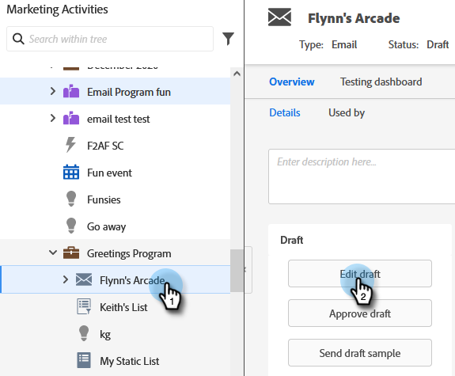

# Remplacer le domaine principal pour les e-mails {#overwrite-primary-domain-for-emails}

Vous pouvez remplacer le domaine de marque principal par e-mail. Cela modifie la manière dont les liens sont marqués lors de l’envoi de l’e-mail.

1. Accédez à **[!UICONTROL Activités marketing]**.

   

1. Sélectionnez un e-mail et cliquez sur **[!UICONTROL Modifier le brouillon]**.

   

1. Sélectionnez le domaine de branding que vous souhaitez utiliser.

   

   >[!NOTE]
   >
   >Tous les utilisateurs ne disposent pas des autorisations nécessaires pour définir le domaine de marque par e-mail. Contactez votre administrateur si le menu déroulant [!UICONTROL Domaines de marque] ne s’affiche pas.
