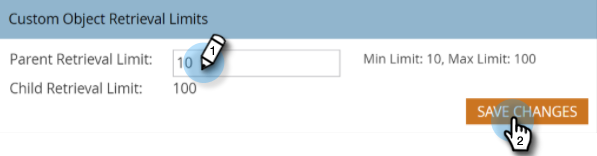

# Modifier les limites de récupération d’objet personnalisé dans [!DNL Velocity Scripting] {#change-custom-object-retrieval-limits-in-velocity-scripting}

Si vous utilisez [!DNL Velocity Script] pour afficher des données d’objet personnalisé dans des e-mails, cette fonctionnalité peut être pour vous. Par défaut, vous êtes autorisé à accéder à 10 objets personnalisés parents à partir de Velocity Script. Si vous avez besoin d’accéder à plus d’informations, lisez la suite.

## Qu’est-ce que [!DNL Velocity] {#what-is-velocity}

[[!DNL Apache Velocity]](https://velocity.apache.org/) est un langage conçu sur [!DNL Java] pour créer des modèles et des scripts de contenu HTML. Marketo permet de l’utiliser dans le contexte des e-mails à l’aide de [ jetons de script ](/help/marketo/product-docs/email-marketing/general/using-tokens/create-an-email-script-token.md). Cela permet, entre autres, d’accéder aux données stockées dans des objets personnalisés.

Vous pouvez référencer des objets personnalisés parents et enfants directement connectés au lead ou au contact, mais pas des objets personnalisés de troisième niveau. Pour chaque objet personnalisé, les 10 enregistrements mis à jour le plus récemment par personne/contact sont disponibles au moment de l’exécution et sont triés de la plus récente mise à jour (à 0) à la plus ancienne mise à jour (à 9).

## Modification de la limite {#how-to-change-the-limit}

1. Accédez à la section **[!UICONTROL Admin]**.

   

1. Cliquez sur **[!UICONTROL E-mail]**.

   

1. Dans le tableau [!UICONTROL Limites de récupération d&#39;objet personnalisé], saisissez une nouvelle [!UICONTROL Limite de récupération du parent] et cliquez sur **[!UICONTROL Enregistrer les modifications]**.

   

>[!NOTE]
>
>La valeur [!UICONTROL  Limite de récupération parente ] doit être comprise entre 10 et 100. La [!UICONTROL limite de récupération des enfants] est définie automatiquement pour vous. Pour ce faire, divisez 1 000 par la [!UICONTROL  Limite de récupération du parent ]. Par exemple, si vous définissez la limite Parent sur 50, la limite Enfant devient 20 (1 000 ÷ 50 = 20).

Joli ! Vous pouvez désormais accéder à d’autres objets personnalisés à partir de [!DNL Velocity script].
