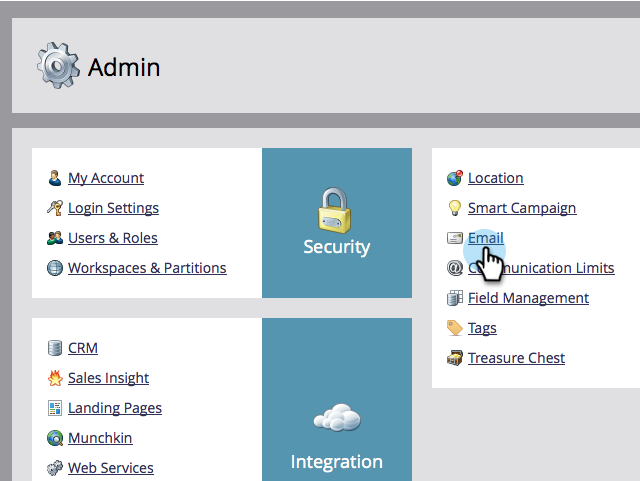

# Modifier l’adresse e-mail et le libellé de l’expéditeur ou de l’expéditrice par défaut {#change-the-default-from-email-and-from-label}

Chaque utilisateur administrateur peut modifier les valeurs par défaut pour **[!UICONTROL E-mail de l’expéditeur]** et **[!UICONTROL Libellé de l’expéditeur]** afin que, lorsqu’il crée de nouveaux e-mails, ces valeurs par défaut soient utilisées.

>[!NOTE]
>
>**Autorisations d’administrateur requises**

1. Accédez à la section **[!UICONTROL Admin]**.

   

1. Cliquez sur **[!UICONTROL Email]**.

   

1. Saisissez les valeurs par défaut souhaitées pour **[!UICONTROL E-mail de l’expéditeur]** et **[!UICONTROL Libellé de l’expéditeur]** puis cliquez sur **[!UICONTROL Enregistrer les modifications]**.

   

>[!NOTE]
>
>La modification s’applique uniquement à vous et non aux autres utilisateurs de Marketo.

Bon travail ! Chaque fois que vous créez un e-mail, les valeurs par défaut que vous définissez sont utilisées.
