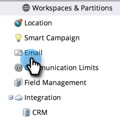

# Modifier le message de désabonnement {#edit-the-unsubscribe-message}

>[!NOTE]
>
>**Autorisations d’administration requises**

Lorsque vous envoyez des e-mails marketing (non [opérationnels](/help/marketo/product-docs/email-marketing/general/functions-in-the-editor/make-an-email-operational.md)), le texte de désabonnement et les liens sont ajoutés en bas. Vous pouvez modifier les valeurs par défaut.

## Où effectuer la modification {#where-to-make-the-edit}

1. Accédez à la section **[!UICONTROL Admin]**.

   

1. Cliquez sur **[!UICONTROL E-mail]**.

   

   >[!CAUTION]
   >
   >Les variables suivantes sont critiques. Ne les supprimez pas !
   >
   >* `%mkt_opt_out_prefix%`
   >* `mkt_unsubscribe=1&mkt_tok=##MKT_TOK##`

1. Modifiez les versions **[!UICONTROL Se désabonner d’HTML]** et **[!UICONTROL Se désabonner du texte]** selon vos besoins, puis cliquez sur **[!UICONTROL Enregistrer les modifications]**.

   

>[!TIP]
>
>* N’oubliez pas de tester. Vous ne souhaitez pas que vos e-mails marketing aient des liens de désabonnement rompus.
>
>* Vous pouvez personnaliser la position de l’HTML de désabonnement dans votre e-mail à l’aide de [jetons](/help/marketo/product-docs/email-marketing/general/using-tokens/add-a-system-token-as-a-link-in-an-email.md).

## Texte de désabonnement par défaut {#default-unsubscribe-text}

Si vous devez revenir au message de désabonnement système par défaut, copiez/collez les éléments suivants :

[!UICONTROL Désabonnement d’HTML] :
`
If you no longer wish to receive these emails, click on the following link: <a href="%mkt_opt_out_prefix%UnsubscribePage.html?mkt_unsubscribe=1&mkt_tok=##MKT_TOK##">Unsubscribe</a> 
`
 
[!UICONTROL Texte de désabonnement] :
`%mkt_opt_out_prefix%UnsubscribePage.html?mkt_unsubscribe=1&mkt_tok=##MKT_TOK##`

>[!MORELIKETHIS]
>
>[Modifier le message Afficher en tant que page web »](/help/marketo/product-docs/administration/email-setup/edit-the-view-as-web-page-message.md)
