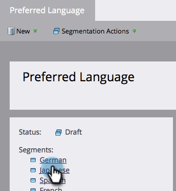
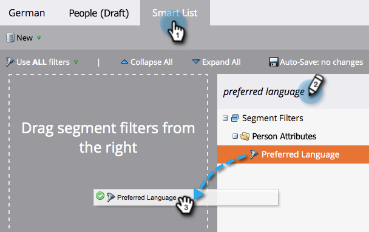
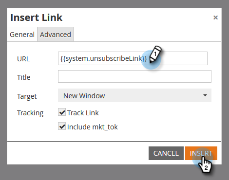
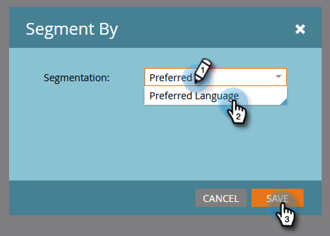
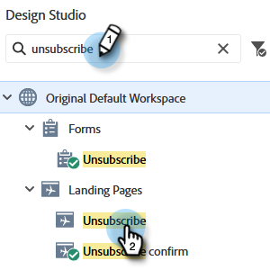
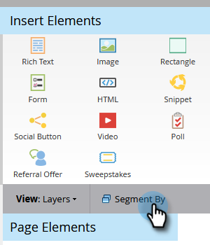

# Rendre votre message de désabonnement dynamique pour les langues {#make-your-unsubscribe-message-dynamic-for-languages}

Le message et le lien de désabonnement par défaut sont en anglais. Vous pouvez utiliser du contenu dynamique pour l’afficher dans différentes langues.

>[!NOTE]
>
>Cet article représente une bonne pratique, mais peut être réalisé d’autres façons.

## Préparation des données {#prepare-your-data}

1. [Créez un champ personnalisé](/help/marketo/product-docs/administration/field-management/create-a-custom-field-in-marketo.md) appelé « Langue préférée ». (Configurez-le dans votre CRM si vous souhaitez que ce champ soit synchronisé).

   >[!TIP]
   >
   >À l’avenir, utilisez ce champ lorsque vous [créez un formulaire](/help/marketo/product-docs/demand-generation/forms/creating-a-form/create-a-form.md) pour capturer les préférences linguistiques.

## Créer une segmentation {#create-segmentation}

1. Accédez à la **[!UICONTROL Base de données]**.

   

1. Dans la liste déroulante **[!UICONTROL Nouveau]**, cliquez sur **[!UICONTROL Nouvelle segmentation]**.

   

1. Nommez la segmentation **[!UICONTROL Langue préférée]**. Cliquez sur **[!UICONTROL Ajouter un segment]**. Saisissez une langue.

   

   >[!NOTE]
   >
   >Le segment par défaut sera l’anglais.

1. Continuez à ajouter des segments jusqu’à ce que toutes les langues soient représentées. Cliquez sur **[!UICONTROL Créer]**.

   

1. Sélectionnez un segment.

   

1. Accédez à l’onglet **[!UICONTROL Liste dynamique]**. Saisissez **[!UICONTROL Langue préférée]** dans le champ de recherche. Faites glisser et déposez le filtre sur la zone de travail.

   

1. Définissez la langue correspondante appropriée.

   

1. Répétez l’opération pour toutes vos langues. Sélectionnez ensuite le menu déroulant **[!UICONTROL Actions de segmentation]** et cliquez sur **[!UICONTROL Approuver]**.

   

## Créer un extrait {#create-a-snippet}

1. Accédez au **[!UICONTROL Design Studio]**.

   

1. Dans la liste déroulante **[!UICONTROL Nouveau]**, cliquez sur **[!UICONTROL Nouveau fragment de code]**.

   

1. Nommez le fragment de code **Message de désabonnement**. Cliquez sur **[!UICONTROL Créer]**.

   

1. Saisissez votre message de désabonnement par défaut, mettez-le en surbrillance, puis cliquez sur l’icône de lien hypertexte.

   

1. Copiez et collez ce jeton : `{{system.unsubscribeLink}}` dans le champ **[!UICONTROL URL]**. Cliquez sur **[!UICONTROL Insérer]**.

   

1. Sélectionnez **[!UICONTROL Segmenter par]** dans la section **[!UICONTROL Segmentation]**.

   

1. Dans le menu déroulant **[!UICONTROL Segmentation]**, saisissez **[!UICONTROL Préféré]** et sélectionnez **[!UICONTROL Langue préférée]**. Cliquez sur **[!UICONTROL Enregistrer]**

   

1. Sélectionnez un segment dans l’arborescence. Cliquez sur votre désabonnement, puis sur l’icône de lien.

   

1. Vérifiez que `{{system.unsubscribeLink}}` se trouve toujours dans le champ **[!UICONTROL URL]**. Modifiez le **[!UICONTROL Texte d’affichage]** pour qu’il corresponde à la langue sélectionnée. Cliquez sur **[!UICONTROL Appliquer]**.

   

1. Répétez l’opération pour tous vos segments. Revenez ensuite au **[!UICONTROL Design Studio]**, cliquez sur la liste déroulante **[!UICONTROL Actions liées aux fragments de code]**, puis sur **[!UICONTROL Approuver]**.

   

Génial. Presque là !

## Utiliser un fragment de code dans un e-mail {#use-snippet-in-an-email}

1. Dans l’éditeur d’e-mail, cliquez sur l’élément modifiable. Cliquez ensuite sur l’icône d’engrenage et sélectionnez **[!UICONTROL Remplacer par le fragment de code]**. Si vous sélectionnez un élément de fragment de code modifiable, cliquez sur l’icône d’engrenage et sélectionnez **[!UICONTROL Modifier]**.

   

1. Recherchez et sélectionnez le fragment de code dans la liste déroulante, puis cliquez sur **[!UICONTROL Enregistrer]**.

   

1. Pour le tester, cliquez sur **[!UICONTROL Précédent]**...

   

1. ...puis l’onglet **[!UICONTROL Dynamique]**.

   

1. Cliquez sur les différentes langues pour afficher la modification du fragment de code.

   

   >[!TIP]
   >
   >Bien sûr, vous pouvez également modifier le reste de votre e-mail pour le langage dynamique. Pendant que vous y êtes, procédez de la même manière sur la page de désabonnement.

## Personnalisation de votre page de désabonnement avec du contenu dynamique {#customizing-your-unsubscribe-page-with-dynamic-content}

Si vous souhaitez que vos salariés visitent une page de désabonnement dans leur langue préférée, vous pouvez utiliser du contenu dynamique sur la page de destination et la page de confirmation.

1. Accédez au **[!UICONTROL Design Studio]**.

   

1. Saisissez _Se désabonner_ dans le champ de recherche, puis sélectionnez la page de désabonnement de votre choix.

   

1. Cliquez sur **[!UICONTROL Modifier le brouillon]**.

   

1. Sélectionnez **[!UICONTROL Segmenter par]**.

   

1. Recherchez le segment **[!UICONTROL Langue préférée]**. Cliquez sur **[!UICONTROL Enregistrer]**

   

   Modifiez le contenu de chaque page de destination, approuvez-la et tout est prêt !

   >[!NOTE]
   >
   >En savoir plus sur le [contenu dynamique](/help/marketo/product-docs/personalization/segmentation-and-snippets/segmentation/understanding-dynamic-content.md) et sur tout ce que vous pouvez faire.
