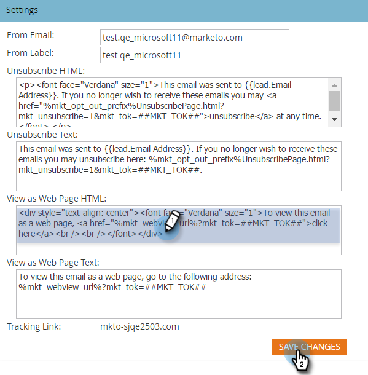

# Modifier le message &quot;Vue en tant que page Web&quot; {#edit-the-view-as-web-page-message}

Si vous devez modifier le texte &quot; [Vue en tant que page](../../../product-docs/email-marketing/general/functions-in-the-editor/add-a-view-as-web-page-link-to-an-email.md)Web&quot;, voici comment procéder.

>[!NOTE]
>
>**Autorisations d’administrateur requises**

## Modifier le message &quot;Vue en tant que page Web&quot; {#edit-the-view-as-web-page-message-1}

1. Sous **Admin**, cliquez sur **Courriel**.

   

   >[!CAUTION]
   >
   >Les variables suivantes sont essentielles. Ne les supprimez pas !
   >
   >    
   >    
   >    * %mkt_webview_url%?mkt_tok=##MKT_TOK##
   >    
   >    
   >La deuxième partie ##MKT_TOK## est le cookie commun de cette personne. Il s’assure qu’ils reçoivent un cookie approprié lorsqu’ils cliquent sur le lien.

1. Modifiez la **Vue en tant que page Web HTML** et **Vue en tant que texte de page Web **versions à votre convenance, puis cliquez sur **Enregistrer les modifications**.

   

>[!CAUTION]
>
>Veillez à éviter :
>
>* Ajoute d’URL supplémentaires dans l’une ou l’autre des zones HTML
>* Placement de code HTML dans la version de texte

>

Voilà. Envoyer des courriers électroniques de test pour assurer la mise en forme.

## Texte par défaut &quot;Vue en tant que page Web&quot; {#default-view-as-web-page-text}

Si vous devez revenir au système par défaut &quot;Vue en tant que page Web&quot;, copiez/collez les éléments suivants :

**Vue en tant que page Web HTML :**
`<pre data-theme="Confluence">
To view this email as a web page, <a href="%mkt_webview_url%?mkt_tok=##MKT_TOK##">click here</a>
</pre>` **Vue en tant que texte de page Web :**

Pour vue de ce courrier électronique en tant que page Web, accédez à l’adresse suivante :
`<pre data-theme="Confluence">%mkt_webview_url%?mkt_tok=##MKT_TOK##</pre>` Boum ! Vous avez terminé.
