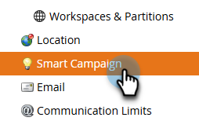

# Suivi des ouvertures de courriers électroniques au niveau de la campagne {#email-open-tracking-at-campaign-level}

Cette fonctionnalité vous permet de contrôler le suivi des ouvertures des emails, soit une fois pour chaque ouverture d’une campagne, soit une seule fois pour chaque email, indépendamment du nombre de fois où il est utilisé dans différentes campagnes.

>[!NOTE]
>
>**Autorisations d’administrateur requises**

1. Accédez à la zone **Admin**.

   

1. Cliquez sur **Campagne dynamique**.

   

1. En regard de _Paramètres des ouvertures de courrier électronique_, cliquez sur **Modifier**.

   

1. Cliquez sur la liste déroulante, sélectionnez le paramètre de votre choix, puis cliquez sur **Enregistrer**.

   

<table><tbody>
  <tr>
    <td><b>Activé</b></td>
    <td>Les ouvertures d’email sont suivies séparément pour chaque campagne.</td>
  </tr>
  <tr>
    <td><b>Désactivé</b></td>
    <td>Les ouvertures d’email sont suivies...</td>
  </tr>
</tbody>
</table>
