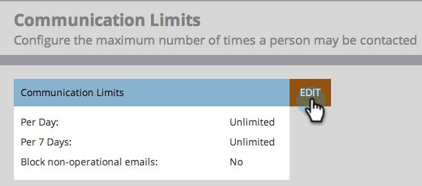

# Activer les limites de communication {#enable-communication-limits}

Il est très important de ne pas trop communiquer avec vos employés. Définir des limites de communication aidera à empêcher votre organisation d’envoyer trop d’e-mails.

>[!NOTE]
>
>**Autorisations d’administration requises**

1. Accédez à la zone **[!UICONTROL Admin]**.

   

1. Cliquez sur **[!UICONTROL Limites de communication]**.

   

1. Cliquez sur **[!UICONTROL Modifier]**.

   

   >[!NOTE]
   >
   >Le [!UICONTROL par jour] est basé sur le jour calendaire dans le fuseau horaire de l&#39;abonnement (minuit-minuit).

1. Cliquez sur le menu déroulant **[!UICONTROL Par jour]** et sélectionnez la limite souhaitée. Dans cet exemple, nous choisissons 1.

   

   >[!TIP]
   >
   >Vous pouvez également choisir **[!UICONTROL Personnalisé]** si aucune des options prédéfinies ne fonctionne pour vous.

1. Cliquez sur le menu déroulant **[!UICONTROL Par période de 7 jours]** et sélectionnez la limite souhaitée. Dans cet exemple, nous choisissons 5.

   

1. Sélectionnez **[!UICONTROL Bloquer les e-mails non opérationnels]**.

   

   >[!NOTE]
   >
   >En savoir plus sur ce que sont les [ e-mails opérationnels ](/help/marketo/product-docs/email-marketing/general/functions-in-the-editor/make-an-email-operational.md).

1. Cliquez sur **[!UICONTROL Enregistrer]**

   

   >[!NOTE]
   >
   >**Exemple**
   >
   >Les paramètres ci-dessus signifient que les personnes ne recevront pas plus de **e-mails par jour** ou plus de **5 au cours d’une période de sept jours**.

   >[!NOTE]
   >
   >Les limites de communication s’appliquent automatiquement à tous les programmes de messagerie et d’engagement.

>[!MORELIKETHIS]
>
>[Appliquer les limites de communication à  [!DNL Smart Campaign]](/help/marketo/product-docs/core-marketo-concepts/smart-campaigns/using-smart-campaigns/apply-communication-limits-to-smart-campaign.md)
