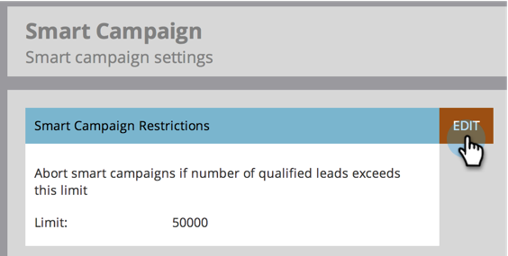

# Activation des restrictions sur les personnes pour les campagnes dynamiques {#enable-person-restrictions-for-smart-campaigns}

Il existe une fonctionnalité dans Marketo pour limiter le nombre _maximum_ de personnes pouvant être qualifiées pour une campagne dynamique. Cela évite d’envoyer accidentellement par courrier électronique votre base de données entière.

>[!NOTE]
>
>**Autorisations d’administrateur requises**

>[!CAUTION]
>
>Cela s’applique uniquement aux campagnes par lots et aux programmes de messagerie.

1. Accédez à la zone **[!UICONTROL Admin]**.

   

1. Cliquez sur **[!UICONTROL Campagne dynamique]**.

   

1. Cliquez sur **[!UICONTROL Modifier]**.

   

   >[!CAUTION]
   >
   >Si le nombre de personnes pouvant exécuter une campagne dynamique dépasse la limite définie, elle ne s’exécutera pas du tout.

1. Saisissez une limite et cliquez sur **[!UICONTROL Enregistrer]**.

   

   >[!TIP]
   >
   >Désactivez cette fonction en rendant ce champ vide.

   >[!CAUTION]
   >
   >Cette limite s’applique à toutes les campagnes intelligentes, mais elle peut être remplacée au niveau de la campagne. Découvrez comment [ remplacer les restrictions de personne dans une campagne dynamique ](/help/marketo/product-docs/core-marketo-concepts/smart-campaigns/using-smart-campaigns/override-person-restrictions-in-a-smart-campaign.md).

C&#39;est fait ! Vous venez d&#39;allumer l&#39;interrupteur de sécurité.

>[!MORELIKETHIS]
>
>[Remplacer les restrictions de personne dans une campagne dynamique](/help/marketo/product-docs/core-marketo-concepts/smart-campaigns/using-smart-campaigns/override-person-restrictions-in-a-smart-campaign.md)
