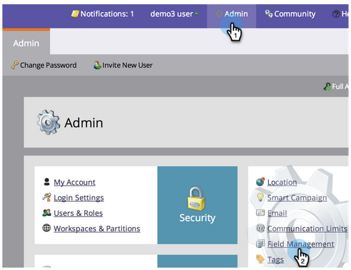

# Bloquer les mises à jour d&#39;un champ {#block-updates-to-a-field}

Le blocage des mises à jour d’un champ vous permet d’écrire une seule fois dans le champ, puis de conserver la valeur d’origine pour la durée de vie du champ. Cela peut s’avérer utile pour un champ comme Source de personne.

>[!NOTE]
>
>**Autorisations d’administrateur requises**

1. Accédez à **Admin** et cliquez sur **Gestion des champs**.

   

1. Recherchez le champ, sélectionnez-le, puis sous **Actions de champ**, cliquez sur **Bloquer les mises à jour de champ**.

   

1. Sélectionnez les **Sources d&#39;entrée** que vous souhaitez bloquer et cliquez sur **Appliquer**.

   

   >[!CAUTION]
   >
   >Lors d&#39;une importation de liste, l&#39;état d&#39;un champ bloqué dans la Prévisualisation d&#39;importation ne s&#39;affiche que si le champ est automatiquement reconnu par Marketo en fonction du nom du champ correspondant à _exactement_ (ou si des alias sont établis). Si le champ est sélectionné manuellement dans la liste déroulante Champ marketing, l’état bloqué ne s’affiche pas dans la Prévisualisation d’importation, mais le blocage des mises à jour vers ce champ est toujours implémenté.
