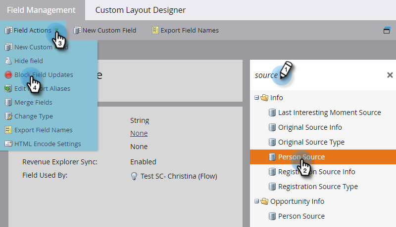

# Bloquer les mises à jour d’un champ {#block-updates-to-a-field}

Le blocage des mises à jour d’un champ vous permet d’écrire dans le champ une seule fois, puis de conserver la valeur d’origine pour la durée de vie du champ. Cela peut s’avérer utile pour un champ comme [!UICONTROL Person Source].

>[!NOTE]
>
>**Autorisations d’administrateur requises**

1. Accédez à la zone **[!UICONTROL Admin]**.

   

1. Cliquez sur **[!UICONTROL Gestion des champs]**.

   

1. Recherchez le champ, sélectionnez-le, puis sous **[!UICONTROL Actions de champ]**, cliquez sur **[!UICONTROL Bloquer les mises à jour de champ]**.

   

   >[!NOTE]
   >
   >Vous pouvez également bloquer les mises à jour des [champs personnalisés du membre de programme](/help/marketo/product-docs/core-marketo-concepts/programs/working-with-programs/program-member-custom-fields.md).

1. Sélectionnez les **[!UICONTROL Sources d’entrée]** à bloquer, puis cliquez sur **[!UICONTROL Appliquer]**.

   

   >[!CAUTION]
   >
   >Lors d’un import de liste, l’état d’un champ bloqué dans l’aperçu de l’import ne s’affiche que si le champ est automatiquement reconnu par Marketo en fonction du nom du champ correspondant _exactement_ (ou si des alias sont établis). Si le champ est sélectionné manuellement dans la liste déroulante Champ de Marketo , le statut Bloqué ne s’affiche pas dans l’aperçu de l’importation, mais le blocage de la mise à jour appliqué à ce champ est toujours implémenté.
