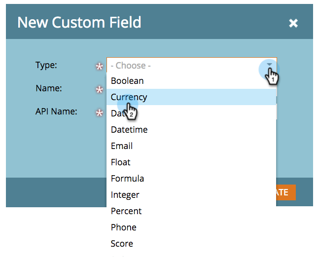

# Modification du type d’un champ personnalisé de marketing {#change-the-type-of-a-marketo-custom-field}

Voici comment modifier le type de champ d’un champ personnalisé.

1. Accédez à **Admin **et cliquez sur Gestion des **** champs.

   

1. Recherchez et sélectionnez le champ de votre choix.

   

1. Dans la liste déroulante Actions **** de champ, cliquez sur **Changer de type**.

   

1. Sélectionnez le nouveau type.

   >[!NOTE]
   >
   >Les champs de note et de formule ne peuvent pas être modifiés.

   

1. Lisez l&#39;avertissement, puis cliquez sur **Modifier **pour confirmer.

   

   >[!NOTE]
   >
   >Le message d’avertissement qui s’affiche varie en fonction du type de champ que vous changez de/vers.

   >[!NOTE]
   >
   >**Articles connexes**
   >
   >    
   >    
   >    * [Créer un champ personnalisé dans Marketo](create-a-custom-field-in-marketo.md)

Votre champ personnalisé est désormais d’un type différent. Hourra !