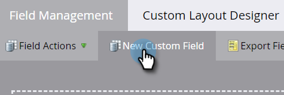

# Créer un champ personnalisé dans Marketo {#create-a-custom-field-in-marketo}

Découvrez comment créer un champ personnalisé dans Marketo Engage pour stocker et capturer des données.

1. Accédez à la zone **[!UICONTROL Admin]**.

   

1. Cliquez sur **[!UICONTROL Gestion des champs]**.

   

   >[!TIP]
   >
   >Si vous souhaitez que les champs soient synchronisés avec votre CRM, créez-les dans le CRM et elles seront automatiquement créées dans Marketo.

1. Cliquez sur **[!UICONTROL Nouveau champ personnalisé]**.

   

1. Choisissez l’_[!UICONTROL Objet]_.

   

   >[!NOTE]
   >
   >Bien que vous ne puissiez pas sélectionner vous-même l’objet _Company_, vous pouvez en faire la demande en contactant le support technique de [Marketo](https://nation.marketo.com/t5/support/ct-p/Support){target="_blank"}.

1. Choisissez le champ _[!UICONTROL Type]_. Cela modifiera son rendu dans les listes dynamiques et les formulaires dans Marketo.

   >[!TIP]
   >
   >Consultez le [Glossaire des types de champs personnalisés](/help/marketo/product-docs/administration/field-management/custom-field-type-glossary.md){target="_blank"}.

   

1. Saisissez le _[!UICONTROL Nom]_ tel que vous souhaitez qu’il apparaisse dans Marketo (le _[!UICONTROL Nom de l’API]_ est généré automatiquement). Choisissez avec soin, car il ne peut pas être renommé après avoir été enregistré. Cliquez sur **[!UICONTROL Créer]** lorsque vous avez terminé.

>[!CAUTION]
>
>Les noms de champ ne peuvent pas commencer par les caractères suivants : **. &amp; +[]**

>[!NOTE]
>
>Le nom de l’API est utilisé par l’API SOAP et d’autres processus principaux.

Vous pouvez désormais utiliser ce champ personnalisé dans les formulaires, les étapes de flux et les listes dynamiques.
