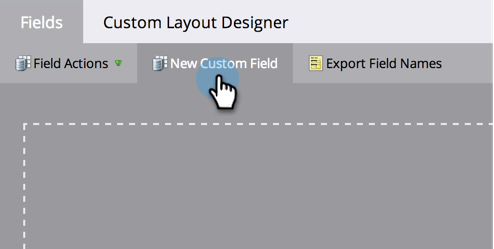

# Créer et utiliser un champ de chaîne concaténée (formule) {#create-and-use-a-concatenated-string-formula-field}

Vous pouvez combiner des valeurs provenant de plusieurs champs ou créer une valeur conditionnelle à l’aide d’un champ de formule de Marketo Engage.

1. Accédez au **[!UICONTROL Administration]** zone.

   

1. Cliquez sur **[!UICONTROL Gestion des champs]**.

   

1. Cliquez sur **[!UICONTROL Nouveau champ personnalisé]**.

   

1. Sélectionner **[!UICONTROL Formule]** pour le **[!UICONTROL Type]**.

   

1. Saisissez un **[!UICONTROL Nom]** pour votre champ, puis cliquez sur **[!UICONTROL Créer]**.

   

1. Recherchez et sélectionnez votre champ de formule, puis cliquez sur **[!UICONTROL Modifier des règles]**.

   

1. Ajoutez deux options et définissez-les comme la capture d’écran ci-dessous.

   

   >[!TIP]
   >
   >En savoir plus sur [jetons pour les étapes de flux](/help/marketo/product-docs/core-marketo-concepts/smart-campaigns/flow-actions/use-tokens-in-flow-steps.md).

1. Vous pouvez maintenant ajouter le champ de formule en tant que jeton dans un email.

   

>[!NOTE]
>
>Les champs de formule peuvent être utilisés dans les colonnes Pages d’entrée, Emails et Liste dynamique . Les emails contenant des champs de formule peuvent _not_ être envoyé à l’aide d’une campagne par lots. Veuillez utiliser un [jeton de script de courrier électronique](/help/marketo/product-docs/email-marketing/general/using-tokens/create-an-email-script-token.md) dans ce scénario.

Bon travail ! Vous avez maintenant un champ intelligent qui sait quelle formule de salutation inclure en fonction du genre. Amuse-toi bien avec ça et deviens créatif.
