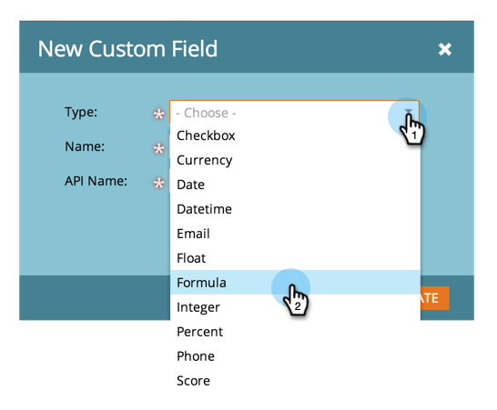

# Créer et utiliser un champ de chaîne concaténée (formule) {#create-and-use-a-concatenated-string-formula-field}

Vous pouvez combiner des valeurs provenant de plusieurs champs ou créer une valeur conditionnelle à l’aide d’un champ de formule Marketo Engage.

1. Accédez à la zone **[!UICONTROL Admin]**.

   

1. Cliquez sur **[!UICONTROL Gestion des champs]**.

   

1. Cliquez sur **[!UICONTROL Nouveau champ personnalisé]**.

   

1. Sélectionnez **[!UICONTROL Formule]** pour le **[!UICONTROL Type]**.

   

1. Saisissez un **[!UICONTROL Nom]** pour votre champ, puis cliquez sur **[!UICONTROL Créer]**.

   

1. Recherchez et sélectionnez votre champ de formule, puis cliquez sur **[!UICONTROL Modifier les règles]**.

   

1. Ajoutez deux choix et définissez-les comme la capture d’écran ci-dessous.

   

   >[!TIP]
   >
   >En savoir plus sur les [jetons pour les étapes de flux](/help/marketo/product-docs/core-marketo-concepts/smart-campaigns/flow-actions/use-tokens-in-flow-steps.md).

1. Vous pouvez maintenant ajouter le champ de formule sous la forme d’un jeton dans un e-mail.

   

>[!NOTE]
>
>Les champs de formule peuvent être utilisés dans les colonnes Pages de destination, E-mails et Liste dynamique. Les e-mails avec des champs de formule ne peuvent _pas_ être envoyés à l’aide d’une campagne par lots. Utilisez un [jeton de script d’e-mail](/help/marketo/product-docs/email-marketing/general/using-tokens/create-an-email-script-token.md) dans ce scénario.
