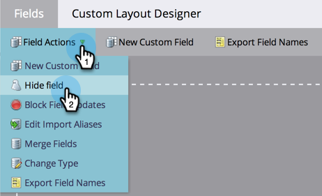

# Supprimer un champ personnalisé dans Marketo {#delete-a-custom-field-in-marketo}

>[!NOTE]
>
>**Autorisations d’administration requises**

Il se peut que vous souhaitiez vous débarrasser d’un champ que vous avez créé dans le passé si vous ne l’utilisez plus. Vous ne pouvez malheureusement pas supprimer des champs dans Marketo, mais vous _pouvez_ les masquer de l’interface utilisateur.

1. Accédez à la zone **[!UICONTROL Admin]**.

   

1. Cliquez sur **[!UICONTROL Gestion des champs]**.

   

1. Cliquez sur la liste déroulante **[!UICONTROL Actions de champ]** et sélectionnez **[!UICONTROL Masquer le champ]**.

   

   Pour obtenir des instructions détaillées, voir [masquer et afficher un champ](/help/marketo/product-docs/administration/field-management/hide-and-unhide-a-field.md).
