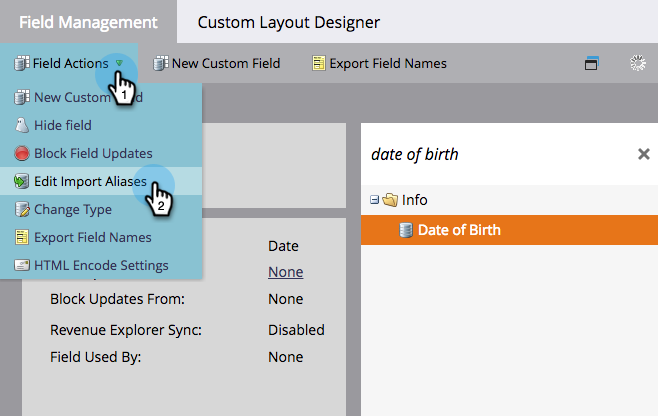
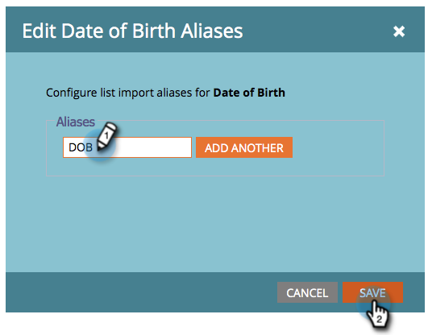

# Modifier les alias de champ pour l’import de liste {#edit-field-aliases-for-list-import}

Lorsque vous importez une liste dont les en-têtes sont inconnus, vous pouvez créer des alias de champ pour simplifier les futures importations. Vous pouvez également modifier ces alias dans la gestion des champs.

>[!NOTE]
>
>**Autorisations d’administration requises**

1. Accédez à la zone **[!UICONTROL Admin]**.

   

1. Cliquez sur **[!UICONTROL Gestion des champs]**.

   

1. Recherchez et sélectionnez le champ auquel vous souhaitez ajouter un alias.

   

1. Dans la liste déroulante **[!UICONTROL Actions de champ]**, cliquez sur **[!UICONTROL Modifier les alias d’importation]**.

   

1. Saisissez un alias et cliquez sur **[!UICONTROL Enregistrer]**.

   

>[!TIP]
>
>Cliquez sur **[!UICONTROL Ajouter autre]** et saisissez d’autres alias si vous en avez besoin.

Désormais, si vous importez une feuille de calcul avec une colonne nommée « DOB », Marketo la reconnaîtra automatiquement comme étant sa « date de naissance » et importera les données dans le champ approprié.

