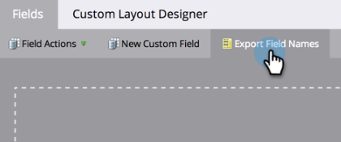

# Exportation d’une liste de tous les noms de champ de l’API Marketo {#export-a-list-of-all-marketo-api-field-names}

Si vous utilisez notre [!DNL SOAP API] ou [!DNL Munchkin API], vous aurez besoin d’une liste de tous vos champs et de leurs noms d’API. Voici comment obtenir cette liste.

>[!NOTE]
>
>**Autorisations d’administrateur requises**

1. Accédez à la zone **[!UICONTROL Admin]**.

   

1. Cliquez sur **[!UICONTROL Gestion des champs]**.

   

1. Cliquez sur **[!UICONTROL Exporter les noms des champs]** pour télécharger la feuille de calcul.

   

Beau ! Vous disposez désormais d’une feuille de calcul avec une liste de tous vos champs et de leurs noms d’API.

>[!NOTE]
>
>La limite de caractères pour les noms d’API MLM est de 255.
