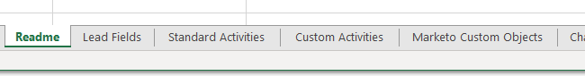

# Exporter toutes les métadonnées d’objet {#export-all-object-metadata}

Cette fonctionnalité vous permet d’exporter tous les objets et leurs métadonnées.

>[!NOTE]
>
>**Autorisations d’administrateur requises**

## Objets {#objects}

* Champs de piste (Personne/Société)
* Objets personnalisés Marketo
* Activités standard
* Activités personnalisées
* Canaux
* Balises

## Exportation des métadonnées d’objet {#export-object-metadata}

1. Dans votre Marketo, cliquez sur **Administration**.

   

1. Sélectionner **Gestion des champs**.

   

1. Cliquez sur **Exporter tous les objets**.

   

>[!NOTE]
>
>Assurez-vous que votre navigateur ne bloque pas les fenêtres contextuelles de Marketo.

Les données seront exportées au format CSV.

