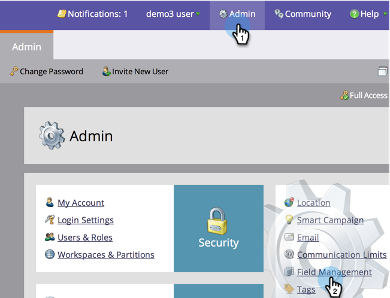

# Masquage et affichage d’un champ {#hide-and-unhide-a-field}

Si vous n’avez plus d’utilisation pour un champ dans Marketo, vous pouvez le masquer dans l’interface utilisateur afin qu’il ne s’affiche plus dans l’application.

## Masquer un champ {#hide-a-field}

>[!NOTE]
>
>**Autorisations d’administrateur requises**

1. Accédez à **Administration** et cliquez sur **Gestion des champs**.

   

1. Recherchez le champ, sélectionnez-le, puis sous **Actions de champ** click **Masquer le champ**.

   

   >[!NOTE]
   >
   >Pour masquer un champ, il ne doit pas être associé à d’autres ressources (y compris les ressources archivées). Veillez à supprimer le champ de toutes les listes intelligentes, les choix d’étape de flux, les formulaires, les courriers électroniques, etc., avant de le masquer.

1. Cliquez sur **Masquer** pour confirmer.

   

   Beau travail ! Vous savez maintenant comment masquer un champ dans l’interface utilisateur de Marketo.

   

## Afficher un champ {#unhide-a-field}

1. Accédez à **Administration** et cliquez sur **Gestion des champs**.

   

1. Recherchez et sélectionnez le champ. Dans la liste déroulante Actions de champ , cliquez sur **Afficher le champ**.

   

   Bon travail ! Vous savez maintenant comment afficher les champs et les rendre à nouveau visibles dans l’interface utilisateur de Marketo.

   >[!TIP]
   >
   >Doit-on effectuer un masquage/affichage en masse ? Contactez les services professionnels de Marketo : services@marketo.com.
