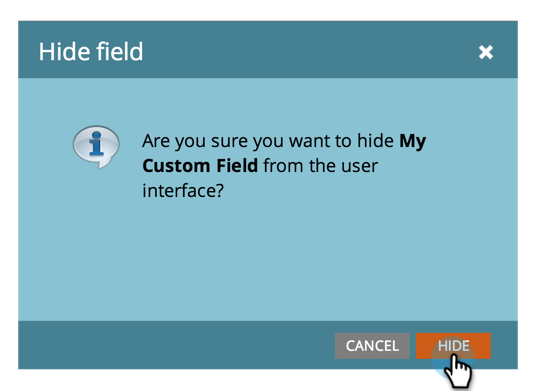

# Masquer et afficher un champ {#hide-and-unhide-a-field}

Si vous n’utilisez plus un champ dans Marketo Engage, vous pouvez le masquer dans l’interface utilisateur afin qu’il ne s’affiche plus dans l’application.

## Masquer un champ {#hide-a-field}

>[!NOTE]
>
>**Autorisations d’administrateur requises**

1. Accédez à la zone **[!UICONTROL Admin]**.

   

1. Cliquez sur **[!UICONTROL Gestion des champs]**.

   

1. Recherchez le champ, sélectionnez-le, puis sous **[!UICONTROL Actions de champ]** cliquez sur **[!UICONTROL Masquer le champ]**.

   

   >[!NOTE]
   >
   >* Pour masquer un champ, il ne doit pas être associé à d’autres ressources (y compris les ressources archivées). Veillez à supprimer le champ de toutes les listes dynamiques, des choix d’étapes de flux, des formulaires, des e-mails, etc., avant de le masquer.
   >* Vous ne pouvez pas masquer les champs (système) standard.
   >* Vous ne pouvez pas masquer les champs d’informations sur l’opportunité.

1. Cliquez sur **[!UICONTROL Masquer]** pour confirmer.

   

   Beau travail ! Vous savez maintenant comment masquer un champ de l’interface utilisateur de Marketo.

   

## Afficher un champ {#unhide-a-field}

1. Accédez à la zone **[!UICONTROL Admin]**.

   

1. Cliquez sur **[!UICONTROL Gestion des champs]**.

   

1. Recherchez et sélectionnez le champ . Dans la liste déroulante [!UICONTROL  Actions de champ ], cliquez sur **[!UICONTROL Afficher le champ]**.

   

   Bon travail ! Vous savez maintenant comment afficher les champs et les rendre à nouveau visibles.
