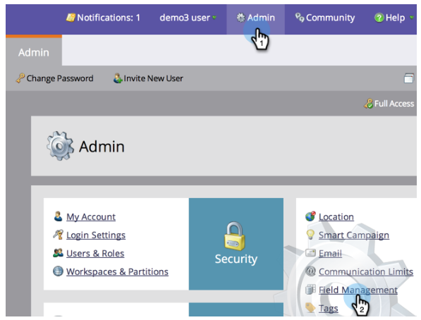

# Renommer un champ {#rename-a-field}

>[!NOTE]
>
>Vous pouvez renommer un champ personnalisé dans Marketo, mais il y a un hic : vous devez supprimer toute son utilisation dans le système avant de le faire. Cela inclut les formulaires, les listes dynamiques et les campagnes dynamiques.

>[!NOTE]
>
>**Autorisations d’administrateur requises**

1. Accédez à Admin et cliquez sur **Gestion des champs**.

   

1. Recherchez et sélectionnez le champ à renommer, puis cliquez sur le nom du champ dans la trame.

   >[!TIP]
   >
   >Cliquez sur le lien **Utilisé par** pour rechercher les ressources qui font référence à ce champ.

   

1. Renommez le champ et cliquez sur **Enregistrer**.

   

Beau boulot ! Vous savez maintenant comment renommer des champs dans Marketo.

>[!CAUTION]
>
>Si vous renommez le nom de l’API dans Salesforce, Marketo créera un nouveau champ et laissera l’ancien derrière vous !
