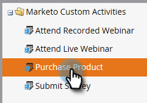
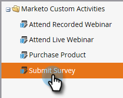

# Ajouter/Modifier/Supprimer des champs d’activité personnalisés Marketo {#add-edit-delete-marketo-custom-activity-fields}

Vous devrez peut-être ajouter, modifier ou même supprimer un champ d’activité personnalisé. Voici comment faire.

## Ajouter un champ d’activité personnalisé {#add-a-custom-activity-field}

1. Accédez à la zone **[!UICONTROL Admin]**.

   

1. Cliquez sur **[!UICONTROL Activités personnalisées Marketo]**.

   

1. Cliquez sur **[!UICONTROL Champs]**.

   

1. Sélectionnez l’activité personnalisée à laquelle vous souhaitez ajouter un champ.

   

1. Cliquez sur **[!UICONTROL Nouveau champ]**.

   

1. Choisissez le [!UICONTROL type de données] du champ.

   

   >[!TIP]
   >
   >Vous ne savez pas quoi sélectionner ? On t&#39;a couvert ! Tous les types de données disponibles sont définis dans [cet article](/help/marketo/product-docs/administration/field-management/custom-field-type-glossary.md).

1. Nommez le champ . Le nom de l’Api est automatiquement renseigné. Lorsque vous avez terminé, cliquez sur **[!UICONTROL Enregistrer]**.

   

   Vous avez terminé. Votre nouveau champ a été ajouté.

## Modification d’un champ d’activité personnalisé {#edit-a-custom-activity-field}

1. Accédez à la zone **[!UICONTROL Admin]**.

   

1. Cliquez sur **[!UICONTROL Activités personnalisées Marketo]**.

   

1. Cliquez sur **[!UICONTROL Champs]**.

   

1. Sélectionnez l’activité personnalisée qui contient le champ à modifier.

   

1. Sélectionnez le champ à modifier, cliquez sur le menu déroulant **[!UICONTROL Actions de champ]**, puis sélectionnez **[!UICONTROL Modifier le champ]**.

   

   Le pop-up **[!UICONTROL Modifier le champ]** s’affiche. Dans cet exemple, nous allons modifier le nom du champ .

   

1. Saisissez le nouveau nom et le nouveau nom de l’Api, puis cliquez sur **[!UICONTROL Enregistrer]**.

   

   >[!NOTE]
   >
   >Le [!UICONTROL nom de l’Api] n’est pas renseigné automatiquement lors de la modification d’un champ. Bien qu’il ne soit pas obligatoire que le champ [!UICONTROL Nom] et le [!UICONTROL Nom de l’API] correspondent, nous vous recommandons de les faire.

   >[!CAUTION]
   >
   >Vous pouvez uniquement modifier le Nom de l’Api ou modifier le champ en Principal si l’activité personnalisée n’a jamais été publiée.

   >[!NOTE]
   >
   >Si vous souhaitez modifier le champ par Principal, vous devez d’abord désélectionner le champ existant.

Votre champ est maintenant modifié.

## Suppression d’un champ d’activité personnalisé {#delete-a-custom-activity-field}

1. Accédez à la zone **[!UICONTROL Admin]**.

   

1. Cliquez sur **[!UICONTROL Activités personnalisées Marketo]**.

   

1. Cliquez sur **[!UICONTROL Champs]**.

   

1. Sélectionnez l’activité personnalisée qui contient le champ à supprimer.

   

1. Sélectionnez le champ à supprimer, cliquez sur la liste déroulante **[!UICONTROL Actions de champ]**, puis sélectionnez **[!UICONTROL Supprimer le champ]**.

   
