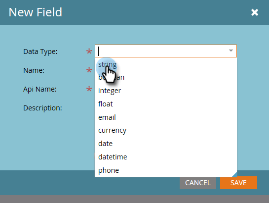
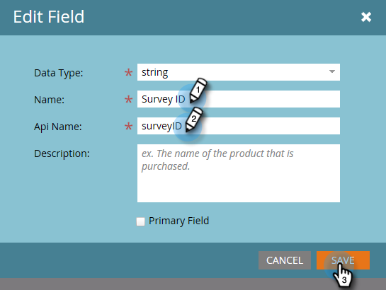
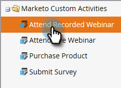

# Ajouter, modifier ou supprimer des champs d’activité personnalisés Marketo {#add-edit-delete-marketo-custom-activity-fields}

Découvrez comment ajouter, modifier ou supprimer un champ d’activité personnalisé.

## Ajouter un champ d’activité personnalisé {#add-a-custom-activity-field}

1. Accédez à la zone **[!UICONTROL Admin]**.

   

1. Cliquez sur **[!UICONTROL Activités personnalisées]**.

   

1. Cliquez sur **[!UICONTROL Champs]**.

   

1. Sélectionnez l’activité personnalisée à laquelle vous souhaitez ajouter un champ.

   

1. Cliquez sur **[!UICONTROL Nouveau champ]**.

   

1. Choisissez le [!UICONTROL type de données] du champ.

   

   >[!TIP]
   >
   >Pour connaître la définition de tous les types de données disponibles, voir [cet article](/help/marketo/product-docs/administration/field-management/custom-field-type-glossary.md).

1. Nommez le champ . Le [!UICONTROL nom de l’API] est automatiquement renseigné. Lorsque vous avez terminé, cliquez sur **[!UICONTROL Enregistrer]**.

   

   Votre nouveau champ a été ajouté.

## Modification d’un champ d’activité personnalisé {#edit-a-custom-activity-field}

1. Accédez à la zone **[!UICONTROL Admin]**.

   

1. Cliquez sur **[!UICONTROL Activités personnalisées]**.

   

1. Cliquez sur **[!UICONTROL Champs]**.

   

1. Sélectionnez l’activité personnalisée qui contient le champ à modifier.

   

1. Sélectionnez le champ à modifier, cliquez sur le menu déroulant **[!UICONTROL Actions de champ]**, puis sélectionnez **[!UICONTROL Modifier le champ]**.

   

   Le pop-up **[!UICONTROL Modifier le champ]** s’affiche. Dans cet exemple, le nom du champ est en cours de modification.

   

1. Saisissez les nouveaux Nom et [!UICONTROL Nom de l’API], puis cliquez sur **[!UICONTROL Enregistrer]**.

   

   >[!NOTE]
   >
   >Le [!UICONTROL nom de l’API] ne se remplit pas automatiquement lors de la modification d’un champ. Bien qu’il ne soit pas obligatoire que le champ [!UICONTROL Nom] et [!UICONTROL Nom de l’API] correspondent, Marketo recommande de les faire.

   >[!CAUTION]
   >
   >Vous pouvez uniquement modifier le [!UICONTROL Nom de l’API] ou remplacer le champ par Principal si l’activité personnalisée n’a jamais été publiée.

   >[!NOTE]
   >
   >Si vous souhaitez modifier le champ par Principal, vous devez d’abord désélectionner le champ existant.

Le champ a été mis à jour.

## Suppression d’un champ d’activité personnalisé {#delete-a-custom-activity-field}

1. Accédez à la zone **[!UICONTROL Admin]**.

   

1. Cliquez sur **[!UICONTROL Activités personnalisées]**.

   

1. Cliquez sur **[!UICONTROL Champs]**.

   

1. Sélectionnez l’activité personnalisée qui contient le champ à supprimer.

   

1. Sélectionnez le champ à supprimer, cliquez sur la liste déroulante **[!UICONTROL Actions de champ]**, puis sélectionnez **[!UICONTROL Supprimer le champ]**.

   
