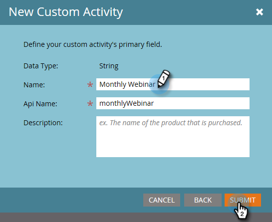

# Créer une Activité personnalisée {#create-a-custom-activity}

Pour créer une activité personnalisée, procédez comme suit.

>[!NOTE]
>
>La plupart des abonnements disposent d’une limite de 10 types d’Activités personnalisées.

1. Cliquez sur **Admin**.

   

1. Dans **Gestion de la base de données**, cliquez sur **Activités personnalisées**.

   

1. Cliquez sur **Nouvelle Activité personnalisée**.

   

1. Saisissez un nom et une description facultative, puis cliquez sur **Suivant**. Le nom de l’API est rempli automatiquement, mais il peut être personnalisé.

   

   >[!CAUTION]
   >
   >Si vous décidez de modifier le nom de l’API, assurez-vous que ce nom n’entre pas en conflit avec les champs d’autres activités personnalisées.

1. Définissez vos **Filtre** et **Déclencheur** et cliquez sur **Suivant**.

   

1. Attribuez un nom à votre champ Principal pour résumer l’activité personnalisée.

   

   Et c&#39;est tout !

>[!MORELIKETHIS]
>
>[Présentation des Activités personnalisées](/help/marketo/product-docs/administration/marketo-custom-activities/understanding-custom-activities.md)
