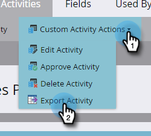

# Exportation de métadonnées d’activité personnalisée {#custom-activity-metadata-export}

Suivez les étapes ci-dessous pour exporter votre schéma de métadonnées d’activité personnalisé.

1. Dans Mon Marketo, cliquez sur **[!UICONTROL Admin]**.

   

1. Cliquez sur **[!UICONTROL Activités personnalisées Marketo]**.

   

1. Sélectionnez l’activité personnalisée Marketo à exporter.

   

1. Cliquez sur le menu déroulant **[!UICONTROL Actions d’activité personnalisées]** et sélectionnez **[!UICONTROL Exporter l’activité]**.

   

>[!NOTE]
>
>L’activité personnalisée doit être à l’état Approuvé pour être exportée.

Vous disposez désormais d’une feuille de calcul avec le schéma de l’activité personnalisée, dans trois onglets.
