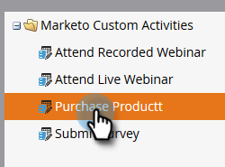

# Modifier une Activité personnalisée {#edit-a-custom-activity}

Vous devez apporter des modifications à une activité personnalisée que vous avez déjà créée ? Voici comment.

1. Cliquez sur **Admin**.

   

1. Dans **Gestion de la base de données**, cliquez sur **Activités personnalisées**.

   

1. Sélectionnez l’activité personnalisée à modifier.

   

1. Cliquez sur **Actions d’Activité personnalisée** et sélectionnez **Modifier l’Activité**.

   

   Modifier le type d&#39;Activité s&#39;affiche. Dans cet exemple, nous réparons une faute de frappe.

   

1. Entrez vos nouvelles informations et cliquez sur **Envoyer**.

   

   Votre activité personnalisée est maintenant modifiée !

   >[!NOTE]
   >
   >Si votre activité était un brouillon au moment de la modification, il reste un brouillon. S’il a été publié, l’état devient Publié avec brouillon.

