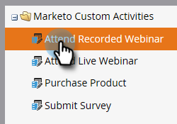

# Publier une activité personnalisée {#publish-a-custom-activity}

Découvrez comment publier votre activité personnalisée.

1. Accédez à la zone **[!UICONTROL Admin]**.

   

1. Cliquez sur **[!UICONTROL Activités personnalisées]**.

   

1. Sélectionnez l’activité personnalisée que vous souhaitez publier.

   

1. Cliquez sur le menu déroulant **[!UICONTROL Actions d’activité personnalisées]** et sélectionnez **[!UICONTROL Publier l’activité]**.

   

   Le [!UICONTROL état] de l’activité personnalisée passe de [!UICONTROL Brouillon]...

   

   ...à [!UICONTROL Publié].

   
