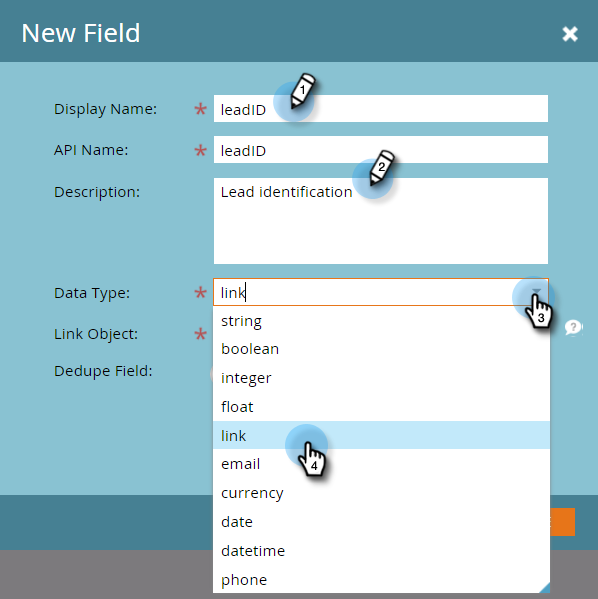

# Ajouter des champs de lien d’objet personnalisé Marketo {#add-marketo-custom-object-link-fields}

Lorsque vous créez des objets personnalisés, vous devez fournir des champs de lien pour connecter l&#39;enregistrement d&#39;objet personnalisé à l&#39;enregistrement parent correct.

* Pour une structure personnalisée un-à-plusieurs, utilisez le champ Lien dans l’objet personnalisé pour le connecter à une personne ou à une entreprise.
* Pour une structure multiple-à-multiple, vous utilisez deux champs de lien, connectés à partir d’un objet intermédiaire créé séparément (qui est également un type d’objet personnalisé). Un lien se connecte aux personnes ou aux sociétés de votre base de données et l’autre se connecte à l’objet personnalisé. Dans ce cas, le champ de lien ne se trouve pas dans l’objet personnalisé lui-même.

>[!IMPORTANT]
>
>Marketo Engage ne prend en charge qu’un seul objet Edge pour chaque objet de pont dans la relation Plusieurs à plusieurs. Dans l’exemple donné ci-dessous, chaque inscription ne peut être liée qu’à un seul cours. Cependant, il peut y avoir de nombreux objets de passerelle pour chaque objet de périphérie, tout comme il y a de nombreuses inscriptions d’étudiants à chaque cours (relation multiple-à-un). Si vos données d’objet personnalisées sont structurées de sorte qu’il existe plusieurs enregistrements d’objet Edge pour chaque enregistrement d’objet Bridge (un à plusieurs ou plusieurs à plusieurs), vous pouvez créer plusieurs enregistrements d’objet Bridge qui font référence chacun à un seul enregistrement d’objet Edge pour représenter ces données dans Marketo.

## Création d’un champ de lien pour une structure de type « Un à plusieurs » {#create-a-link-field-for-a-one-to-many-structure}

Voici comment créer un champ de lien dans un objet personnalisé pour une structure de type « un à plusieurs ».

1. Accédez à la zone **[!UICONTROL Admin]**.

   

1. Cliquez sur **[!UICONTROL Objets personnalisés Marketo]**.

   

1. Sélectionnez l’objet personnalisé dans la liste.

   

1. Dans l&#39;onglet **[!UICONTROL Champs]**, cliquez sur **[!UICONTROL Nouveau champ]**.

   

1. Nommez le champ de lien et ajoutez une [!UICONTROL Description] facultative. Veillez à sélectionner le type de données [!UICONTROL Lien].

   

   >[!CAUTION]
   >
   >Vous ne pourrez pas revenir en arrière et créer, modifier ou supprimer un [!UICONTROL lien] ou [!UICONTROL champ de déduplication] une fois l’objet personnalisé approuvé.

1. Indiquez si le [!UICONTROL objet de lien] concerne un [!UICONTROL prospect] (personne) ou une [!UICONTROL société].

   

   >[!NOTE]
   >
   >Si vous choisissez [!UICONTROL prospect], vous verrez l’ID, l’adresse e-mail et tous les champs personnalisés de la liste.
   >
   >Si vous choisissez [!UICONTROL société], l’ID et les champs personnalisés s’affichent dans la liste.

1. Sélectionnez le [!UICONTROL Champ de lien] auquel vous souhaitez vous connecter en tant que parent du nouveau champ.

   

   >[!NOTE]
   >
   >Seuls les types de champ de chaîne sont pris en charge dans le [!UICONTROL champ de lien].

1. Cliquez sur **[!UICONTROL Enregistrer]**.

   

## Création d’un champ de lien pour une structure N-N {#create-a-link-field-for-a-many-to-many-structure}

Voici comment créer un champ de lien dans un objet intermédiaire à utiliser dans une structure multiple-à-multiple.

>[!PREREQUISITES]
>
>Vous devez avoir déjà créé l’objet intermédiaire et les objets personnalisés que vous avez l’intention de lier.

1. Accédez à la zone **[!UICONTROL Admin]**.

   

1. Cliquez sur **[!UICONTROL Objets personnalisés Marketo]**.

   

1. Sélectionnez l’objet intermédiaire auquel vous souhaitez ajouter le champ.

   

1. Dans l&#39;onglet **[!UICONTROL Champs]**, cliquez sur **[!UICONTROL Nouveau champ]**.

   

1. Vous devez créer deux champs de lien. Créez-les une par une. Tout d’abord, nommez le champ pour les membres de votre liste de base de données (ID de prospect, par exemple). Ajoutez une [!UICONTROL Description] facultative. Veillez à sélectionner le [!UICONTROL lien] [!UICONTROL Type de données].

   

   >[!CAUTION]
   >
   >Vous ne pourrez pas revenir en arrière et créer, modifier ou supprimer un [!UICONTROL lien] ou [!UICONTROL champ de déduplication] une fois l’objet personnalisé approuvé.

1. Sélectionnez l’objet [!UICONTROL Link Object] dans votre base de données ; dans ce cas, [!UICONTROL Lead].

   

1. Sélectionnez le [!UICONTROL Champ de lien] auquel vous souhaitez vous connecter, dans ce cas, [!UICONTROL Id].

   

   >[!NOTE]
   >
   >Seuls les types de champ de chaîne sont pris en charge dans le [!UICONTROL champ de lien].

1. Cliquez sur **[!UICONTROL Enregistrer]**.

   

1. Répétez ce processus pour le deuxième lien vers votre objet personnalisé, dans cet exemple, courseID. Le nom [!UICONTROL Objet du lien] sera cours, et le [!UICONTROL Champ du lien] sera courseID. Puisque vous avez déjà créé et approuvé l’objet personnalisé du cours, ces sélections sont disponibles dans les menus déroulants.

   

1. Créez tout autre champ que vous souhaitez utiliser dans votre objet intermédiaire, tel que enrollmentID ou grade.

## Utilisation d’objets personnalisés {#using-custom-objects}

L’étape suivante consiste à utiliser ces objets personnalisés dans des filtres de vos campagnes intelligentes. Avec une relation multiple-à-multiple, vous pouvez sélectionner plusieurs personnes/sociétés et plusieurs objets personnalisés. Dans l’exemple ci-dessous, toutes les personnes de votre base de données qui correspondent à ces critères seront répertoriées. Le champ nom du cours provient de l’objet personnalisé du cours et la note d’inscription provient de l’objet intermédiaire.

>[!MORELIKETHIS]
>
>* [Ajouter des champs d’objet personnalisés Marketo](/help/marketo/product-docs/administration/marketo-custom-objects/add-marketo-custom-object-fields.md)
>* [Modifier et supprimer un objet personnalisé Marketo](/help/marketo/product-docs/administration/marketo-custom-objects/edit-and-delete-a-marketo-custom-object.md)
>* [Présentation des objets personnalisés Marketo](/help/marketo/product-docs/administration/marketo-custom-objects/understanding-marketo-custom-objects.md)
>* [Modifier et supprimer des champs d’objet personnalisés Marketo](/help/marketo/product-docs/administration/marketo-custom-objects/edit-and-delete-marketo-custom-object-fields.md)
