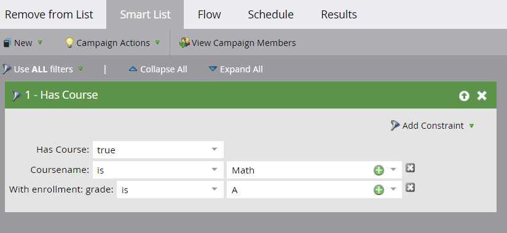

# Ajout de champs de lien d’objet personnalisé Marketo {#add-marketo-custom-object-link-fields}

Lorsque vous créez des objets personnalisés, vous devez fournir des champs de lien pour connecter l’enregistrement d’objet personnalisé à l’enregistrement parent correct.

* Pour une structure personnalisée de type &quot;un à plusieurs&quot;, utilisez le champ de lien dans l’objet personnalisé pour le connecter à une personne ou à une entreprise.
* Pour une structure multiple-à-multiple, vous utilisez deux champs de lien, connectés à un objet intermédiaire créé séparément (qui est également un type d’objet personnalisé). Un lien se connecte aux personnes ou aux entreprises de votre base de données et l’autre à l’objet personnalisé. Dans ce cas, le champ de lien ne se trouve pas dans l’objet personnalisé lui-même.

>[!IMPORTANT]
>
>Marketo Engage ne prend en charge qu’un seul objet de périphérie pour chaque objet de pont dans la relation De plusieurs à plusieurs . Dans l&#39;exemple ci-dessous, chaque inscription ne peut être associée qu&#39;à un seul cours. Cependant, il peut y avoir de nombreux objets de pont pour chaque objet de périphérie, tout comme il y a de nombreuses inscriptions d’étudiants à chaque cours (relation multiple-à-un). Si vos données d’objet personnalisées sont structurées de sorte qu’il existe plusieurs enregistrements d’objet Edge pour chaque enregistrement d’objet Bridge (Un-à-multiple ou Plusieurs-à-multiple), vous pouvez créer plusieurs enregistrements d’objet Bridge qui font référence chacun à un seul enregistrement d’objet Edge pour représenter ces données dans Marketo.

## Création d’un champ de lien pour une structure de type &quot;un à plusieurs&quot; {#create-a-link-field-for-a-one-to-many-structure}

Voici comment créer un champ de lien dans un objet personnalisé pour une structure un-à-plusieurs.

1. Accédez à la zone **[!UICONTROL Admin]**.

   

1. Cliquez sur **[!UICONTROL Marketo Custom Objects]**.

   

1. Sélectionnez l’objet personnalisé dans la liste.

   

1. Dans l’onglet **[!UICONTROL Fields]**, cliquez sur **[!UICONTROL New Field]**.

   

1. Nommez le champ de lien et ajoutez une [!UICONTROL Description] facultative. Veillez à sélectionner le type de données [!UICONTROL Lien] .

   

   >[!CAUTION]
   >
   >Vous ne pourrez pas revenir en arrière et créer, modifier ou supprimer un [!UICONTROL Lien] ou [!UICONTROL Champ de déduplication] une fois l’objet personnalisé approuvé.

1. Indiquez si l’ [!UICONTROL objet de lien] est destiné à un [!UICONTROL prospect] (personne) ou à une [!UICONTROL société].

   

   >[!NOTE]
   >
   >Si vous choisissez [!UICONTROL prospect], vous verrez l’identifiant, l’adresse électronique et tous les champs personnalisés dans la liste.
   >
   >Si vous choisissez [!UICONTROL company], vous verrez l’identifiant et tous les champs personnalisés dans la liste.

1. Sélectionnez le [!UICONTROL champ de lien] auquel vous souhaitez vous connecter en tant que parent du nouveau champ.

   

   >[!NOTE]
   >
   >Seuls les types de champ de chaîne sont pris en charge dans le champ de lien.

1. Cliquez sur **[!UICONTROL Enregistrer]**.

   

## Création d’un champ de lien pour une structure multiple-à-multiple {#create-a-link-field-for-a-many-to-many-structure}

Voici comment créer un champ de lien dans un objet intermédiaire à utiliser dans une structure multiple-à-multiple.

>[!PREREQUISITES]
>
>Vous devez avoir déjà créé l’objet intermédiaire et les objets personnalisés auxquels vous souhaitez le lier.

1. Accédez à la zone **[!UICONTROL Admin]**.

   

1. Cliquez sur **[!UICONTROL Marketo Custom Objects]**.

   

1. Sélectionnez l’objet intermédiaire auquel vous souhaitez ajouter le champ.

   

1. Dans l’onglet **[!UICONTROL Fields]**, cliquez sur **[!UICONTROL New Field]**.

   

1. Vous devez créer deux champs de lien. Créez-les un par un. Tout d’abord, nommez le champ des membres de votre liste de base de données (leadID, par exemple). Ajoutez une [!UICONTROL description] facultative. Veillez à sélectionner le [!UICONTROL lien] [!UICONTROL type de données].

   

   >[!CAUTION]
   >
   >Vous ne pourrez pas revenir en arrière et créer, modifier ou supprimer un [!UICONTROL Lien] ou [!UICONTROL Champ de déduplication] une fois l’objet personnalisé approuvé.

1. Sélectionnez l’ [!UICONTROL objet de lien] dans votre base de données ; dans ce cas, [!UICONTROL piste].

   

1. Sélectionnez le [!UICONTROL champ de lien] auquel vous souhaitez vous connecter, ici [!UICONTROL Id].

   

   >[!NOTE]
   >
   >Seuls les types de champ de chaîne sont pris en charge dans le [!UICONTROL champ de lien].

1. Cliquez sur **[!UICONTROL Enregistrer]**.

   

1. Répétez cette procédure pour le deuxième lien vers votre objet personnalisé, dans cet exemple, courseID. Le nom [!UICONTROL Link Object] sera cours et le [!UICONTROL Link Field] sera courseID. Comme vous avez déjà créé et approuvé l’objet personnalisé du cours, ces sélections sont disponibles dans les menus déroulants.

   

1. Créez d’autres champs que vous souhaitez utiliser dans votre objet intermédiaire, tels que enrollmentID ou grade.

## Utilisation d’objets personnalisés {#using-custom-objects}

L’étape suivante consiste à utiliser ces objets personnalisés dans les filtres de vos campagnes intelligentes. Avec une relation multiple-à-multiple, vous pouvez sélectionner plusieurs personnes/entreprises et plusieurs objets personnalisés. Dans l’exemple ci-dessous, toute personne de votre base de données qui correspond à ces critères sera répertoriée. Le champ coursename provient de l’objet personnalisé de cours et la note d’inscription provient de l’objet intermédiaire.

>[!MORELIKETHIS]
>
>* [Ajouter des champs d’objet personnalisés Marketo](/help/marketo/product-docs/administration/marketo-custom-objects/add-marketo-custom-object-fields.md)
>* [Modifier et supprimer un objet personnalisé Marketo](/help/marketo/product-docs/administration/marketo-custom-objects/edit-and-delete-a-marketo-custom-object.md)
>* [Compréhension des objets personnalisés Marketo](/help/marketo/product-docs/administration/marketo-custom-objects/understanding-marketo-custom-objects.md)
>* [Modifier et supprimer des champs d’objet personnalisés Marketo](/help/marketo/product-docs/administration/marketo-custom-objects/edit-and-delete-marketo-custom-object-fields.md)
