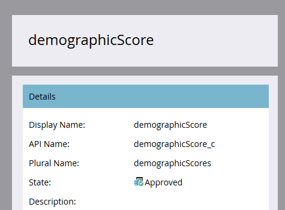
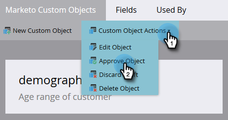

# Approuver un objet personnalisé {#approve-a-custom-object}

Vous devez approuver un objet personnalisé avant de pouvoir l’utiliser. Le processus est légèrement différent pour les nouveaux objets personnalisés et ceux que vous avez modifiés.

## Approuver un nouvel objet personnalisé {#approve-a-new-custom-object}

Un nouvel objet personnalisé a été créé. Suivez les étapes ci-dessous pour l’approuver.

1. Accédez à la zone **[!UICONTROL Admin]**.

   

1. Cliquez sur **[!UICONTROL Objets personnalisés]**.

   

1. Sélectionnez un objet dont l’état est Brouillon.

   

1. Cliquez sur le menu déroulant **[!UICONTROL Actions sur l’objet personnalisé]** et sélectionnez **[!UICONTROL Approuver l’objet]**.

   

1. L’état devient [!UICONTROL Approuvé].

   

   >[!NOTE]
   >
   >Un objet personnalisé utilisé dans une structure _un à plusieurs_ doit avoir au moins un champ de déduplication, un champ de lien, un nom d’objet lié et un nom de champ lié à approuver.
   >
   >Un objet personnalisé utilisé dans une structure _plusieurs à plusieurs_ **ne nécessite pas** de champ de lien, de nom d’objet lié ou de nom de champ lié lorsque vous l’approuvez (car ils résident dans l’objet intermédiaire).
   >
   >Un objet personnalisé utilisé comme _objet intermédiaire_ nécessite un champ de lien, un nom d’objet lié et un nom de champ lié, mais **ne nécessite pas** un champ de déduplication.
   >
   >Voir [Présentation des objets personnalisés Marketo](/help/marketo/product-docs/administration/marketo-custom-objects/understanding-marketo-custom-objects.md) pour plus d’informations.

Vous pouvez maintenant sélectionner votre objet personnalisé dans les contraintes de vos filtres et triggers à utiliser dans vos campagnes.

## Approbation d’un objet personnalisé modifié {#approve-an-edited-custom-object}

Après avoir modifié un objet personnalisé approuvé, vous devez approuver le brouillon pour rétablir l’objet personnalisé à l’état Approuvé .

1. Lorsque vous modifiez un objet personnalisé déjà approuvé, il reçoit le statut [!UICONTROL Approuvé avec brouillon].

   

1. Lorsque vous êtes prêt à approuver le brouillon, cliquez sur le menu déroulant **[!UICONTROL Actions sur l’objet personnalisé]** et sélectionnez **[!UICONTROL Approuver l’objet]**.

   

1. Un aperçu affiche les éléments qui ont été modifiés dans le brouillon. Cliquez sur **[!UICONTROL Approuver]**.

   
