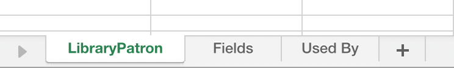

# Exportation de métadonnées d’objet personnalisé {#custom-object-metadata-export}

Si vous utilisez notre API SOAP ou [!DNL Munchkin], le schéma de métadonnées d’objet personnalisé peut être exporté. Voici comment l&#39;obtenir.

>[!AVAILABILITY]
>
>Tous les utilisateurs de Marketo Engage n’ont pas acheté cette fonctionnalité. Pour plus d’informations, contactez l’équipe du compte Adobe (votre gestionnaire de compte).

1. Accédez à la zone **[!UICONTROL Admin]**.

   

1. Cliquez sur **[!UICONTROL Objets personnalisés Marketo]**.

   

1. Sélectionnez l’objet personnalisé Marketo à exporter.

   

1. Cliquez sur le menu déroulant **[!UICONTROL Actions d’objet personnalisées]** et sélectionnez **[!UICONTROL Exporter l’objet]**.

   

>[!NOTE]
>
>L’objet personnalisé doit être à l’état Approuvé pour être exporté.

Vous disposez désormais d’une feuille de calcul avec le schéma de l’objet personnalisé, dans trois onglets.

