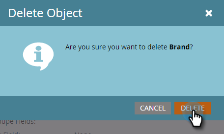

# Modifier et supprimer un objet personnalisé marketing {#edit-and-delete-a-marketo-custom-object}

>[!NOTE]
>
>Vous ne pouvez pas créer, modifier ou supprimer un lien ou un champ de déduplication une fois que l’objet personnalisé a été approuvé.

## Modifier un objet personnalisé {#edit-a-custom-object}

Utilisez le menu Actions d’objet personnalisé pour modifier ou supprimer un objet personnalisé.

1. Cliquez sur **Admin**, puis dans Gestion **de la** base de données, sélectionnez Objets **** personnalisés de marketing à.

   

1. Sélectionnez l’objet personnalisé à modifier à droite.

   

1. Cliquez sur l’onglet Actions **d’objet** personnalisé et sur **Modifier l’objet**.

   

   >[!NOTE]
   >
   >Modifier l’objet affiche les mêmes champs que Créer un objet, à l’exception du nom de l’API, qui ne peut pas être modifié.

1. Effectuez toutes les modifications. Faites glisser le curseur pour afficher l&#39;objet sur la page Détails de piste. Cliquez sur **Enregistrer**.

   

1. Veillez à approuver [l’objet](approve-a-custom-object.md)modifié.

## Suppression d’un objet personnalisé {#delete-a-custom-object}

Il est facile de supprimer un objet personnalisé, mais il faut être prudent. Les objets personnalisés peuvent être connectés à d&#39;autres objets ou à des listes intelligentes. Par conséquent, Marketo vous avertit avant de vous laisser cliquer sur **Supprimer**.

>[!CAUTION]
>
>Vous ne pouvez pas restaurer un objet personnalisé après l&#39;avoir supprimé.

1. Cliquez sur **Admin**, puis dans Gestion **de la** base de données, sélectionnez Objets **** personnalisés de marketing à.

   

1. Sélectionnez l’objet à supprimer.

   

1. Cliquez sur Actions **d’objet** personnalisé et sélectionnez **Supprimer l’objet**.

   

   >[!TIP]
   >
   >Vous pouvez également cliquer avec le bouton droit de la souris sur l’objet et sélectionner **Supprimer l’objet**.

1. Si l’objet personnalisé est sous forme de brouillon, non encore approuvé, vous recevrez cet avertissement. Si vous êtes sûr, cliquez sur **Supprimer**.

   

1. Si l’objet personnalisé est déjà approuvé, vous risquez de le supprimer. Donc, vous allez recevoir cet avertissement plus sévère. Saisissez **Je comprends**, cochez la case **Ne pas annuler** , puis cliquez sur **Supprimer**.

   

   >[!NOTE]
   >
   >Si l’objet personnalisé est lié à un objet intermédiaire, vous devez d’abord supprimer l’objet intermédiaire.

>[!MORELIKETHIS]
>
>[Approuver un objet personnalisé](approve-a-custom-object.md)

