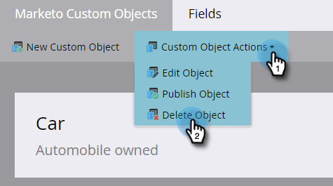

# Modification et suppression d’un objet personnalisé Marketo {#edit-and-delete-a-marketo-custom-object}

>[!NOTE]
>
>Une fois l’objet personnalisé approuvé, vous ne pouvez pas créer, modifier ou supprimer un lien ou un champ de déduplication.

## Modifier un objet personnalisé {#edit-a-custom-object}

Utilisez le menu Actions d’objet personnalisé pour modifier ou supprimer un objet personnalisé.

1. Accédez à la zone **[!UICONTROL Admin]**.

   

1. Cliquez sur **[!UICONTROL Marketo Custom Objects]**.

   

1. Sélectionnez l’objet personnalisé à modifier à droite.

   

1. Cliquez sur l’onglet **[!UICONTROL Actions d’objet personnalisé]** et cliquez sur **[!UICONTROL Modifier l’objet]**.

   

1. Apportez les modifications souhaitées. Faites glisser le curseur au-dessus si vous souhaitez afficher l’objet sur la page Détails de l’piste . Cliquez sur **[!UICONTROL Enregistrer]**.

   

1. Veillez à approuver [l’objet modifié](/help/marketo/product-docs/administration/marketo-custom-objects/approve-a-custom-object.md).

## Suppression d’un objet personnalisé {#delete-a-custom-object}

Il est facile de supprimer un objet personnalisé, mais vous devez être prudent. Les objets personnalisés peuvent être connectés à d’autres objets ou à des listes dynamiques. Marketo vous avertit avant de vous laisser cliquer sur **[!UICONTROL Supprimer]**.

>[!CAUTION]
>
>Une fois supprimé, vous ne pouvez pas restaurer un objet personnalisé.

1. Accédez à la zone **[!UICONTROL Admin]**.

   

1. Cliquez sur **[!UICONTROL Marketo Custom Objects]**.

   

1. Sélectionnez l’objet à supprimer.

   

1. Cliquez sur **[!UICONTROL Actions d’objet personnalisées]** et sélectionnez **[!UICONTROL Supprimer l’objet]**.

   

   >[!TIP]
   >
   >Vous pouvez également cliquer avec le bouton droit de la souris sur l’objet et sélectionner **[!UICONTROL Supprimer l’objet]**.

1. Si l’objet personnalisé est sous forme de version préliminaire, non encore approuvé, cet avertissement s’affiche. Si vous êtes sûr, cliquez sur **[!UICONTROL Supprimer]**.

   

1. Si l’objet personnalisé est déjà approuvé, il y a un risque plus important si vous le supprimez. Donc, vous allez recevoir cet avertissement de stérilisation. Saisissez **[!UICONTROL I understand]**, cochez la case **[!UICONTROL Cannot Undo]** , puis cliquez sur **[!UICONTROL Delete]**.

   

   >[!NOTE]
   >
   >Si l&#39;objet personnalisé est lié à un objet intermédiaire, vous devez d&#39;abord le supprimer.

>[!MORELIKETHIS]
>
>[Approuver un objet personnalisé](/help/marketo/product-docs/administration/marketo-custom-objects/approve-a-custom-object.md)
