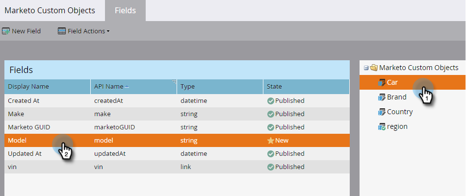

# Modifier et supprimer des champs d’objet personnalisés Marketo {#edit-and-delete-marketo-custom-object-fields}

## Modification d’un champ {#edit-a-field}

Parfois, vous devez modifier un champ qui n’est pas encore approuvé.

1. Cliquez sur un objet personnalisé et sur le champ à modifier.

   

1. Dans l’onglet [!UICONTROL Champs], cliquez sur **[!UICONTROL Actions de champ]** et **[!UICONTROL Modifier le champ]**.

   

1. Apportez vos modifications et cliquez sur **[!UICONTROL Enregistrer]**.

   

   >[!NOTE]
   >
   >Vous ne pouvez pas modifier le nom de l’API.

1. Les modifications apparaissent dans la liste **[!UICONTROL Champs]**.

   

## Suppression d’un champ {#delete-a-field}

Lorsque vous n’avez plus besoin d’un champ dans un objet personnalisé, vous pouvez le supprimer.

1. Dans l’onglet Champs , cliquez sur **[!UICONTROL Actions de champ]** et **[!UICONTROL Supprimer le champ]**.

   

1. Assurez-vous de vraiment vouloir supprimer le champ avant de tirer sur le déclencheur ! Cliquez sur **[!UICONTROL Supprimer]**.

   

C&#39;est parti !

>[!NOTE]
>
>[Ajouter des champs d’objet personnalisés Marketo](/help/marketo/product-docs/administration/marketo-custom-objects/add-marketo-custom-object-fields.md)
