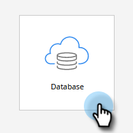
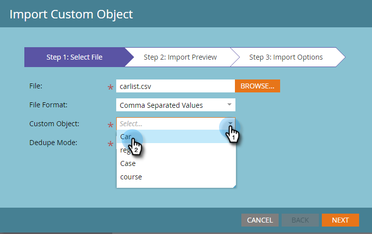

# Importer les données de l’objet personnalisé {#import-custom-object-data}

Suivez les étapes ci-dessous pour importer des données d’objet personnalisées dans votre base de données. Si vous utilisez des objets personnalisés avec des sociétés, voir [Utilisation d’objets personnalisés avec des sociétés](/help/marketo/product-docs/administration/marketo-custom-objects/understanding-marketo-custom-objects.md#using-custom-objects-with-companies) pour plus d’informations.

1. Dans Mon Marketo, accédez à **[!UICONTROL Base de données]**.

   

1. Cliquez sur **[!UICONTROL Nouveau]** et sélectionnez **[!UICONTROL Importer des données d’objet personnalisé]**.

   

1. Cliquez sur **[!UICONTROL Parcourir]** pour localiser le fichier de données. Sélectionnez le format du fichier (valeurs séparées par des virgules dans cet exemple).

   

1. Sélectionnez votre [!UICONTROL objet personnalisé].

   

1. Sélectionnez le [!UICONTROL Mode de déduplication] dans la liste déroulante. Cliquez sur **[!UICONTROL Suivant]**.

   

   >[!NOTE]
   >
   >Utilisez un ou plusieurs champs Dédupliquer comme identifiants uniques lorsque vous créez ou mettez à jour des enregistrements d’objet personnalisés. Cet exemple utilise le champ Dédupliquer de l’objet personnalisé **car** vin (numéro d’ID du véhicule). Si vous mettez uniquement à jour les enregistrements d&#39;objet personnalisés, vous pouvez sélectionner le Guid de Marketo  comme [!UICONTROL Mode de déduplication].

1. Mappez chaque colonne à un champ Marketo, en la sélectionnant dans la liste déroulante.

   

   >[!NOTE]
   >
   >Assurez-vous que les valeurs de votre fichier correspondent au type de champ auquel vous les faites correspondre (par exemple, texte, entier, etc.), sinon le fichier sera rejeté.

1. Cliquez sur **[!UICONTROL Suivant]**.

   

1. Cliquez sur **[!UICONTROL Importer]**.

   

   >[!NOTE]
   >
   >La limite de taille des objets personnalisés est 100MB.

   >[!TIP]
   >
   >Saisissez votre adresse e-mail dans le champ **[!UICONTROL Envoyer l’alerte à]** et Marketo vous enverra un e-mail une fois l’importation terminée.

1. Dans le coin supérieur droit de l’écran, une notification s’affiche pendant l’exécution de l’importation et les résultats finaux une fois celle-ci terminée.

   

>[!MORELIKETHIS]
>
>[Présentation des objets personnalisés Marketo](/help/marketo/product-docs/administration/marketo-custom-objects/understanding-marketo-custom-objects.md)
