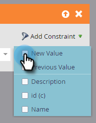

# Déclencher les modifications d&#39;objet personnalisé {#trigger-off-custom-object-changes}

>[!NOTE]
>
>Cette fonctionnalité est disponible uniquement :
>
>* Pour les clients de l&#39;infrastructure Orion
>* Pour une utilisation uniquement avec des objets personnalisés de Marketo, et non avec des objets personnalisés synchronisés via l&#39;intégration native Salesforce ou Microsoft Dynamics
>* Comme déclencheur, pas comme filtre

>
>
Veuillez contacter [Support marketing](http://support.marketo.com) pour activer les déclencheurs de modification d&#39;objet personnalisé.

Dans la liste intelligente d’une campagne dynamique, vous pouvez déclencher une action d’enchaînement lorsqu’un objet personnalisé est ajouté à une personne ou à une société. Vous pouvez également créer une liste dynamique qui utilise comme déclencheur *change* dans un objet personnalisé. Par exemple, utilisez-la pour envoyer un courriel lorsqu’un nom de cours est mis à jour.

>[!NOTE]
>
>Aucune entrée de journal d&#39;activité n&#39;est créée lorsqu&#39;un enregistrement d&#39;objet personnalisé est modifié.

1. Dans Marketo, accédez à **Activités marketing.**

   

1. Créez ou ouvrez une Campaign dynamique existante, puis sélectionnez la Liste dynamique.

   

1. Recherchez le déclencheur dont vous avez besoin et faites-le glisser sur la trame.

   

1. Sélectionnez l’attribut de déclenchement.

   

1. Vous pouvez éventuellement définir une contrainte.

   

1. Et vous voilà. La modification est enregistrée automatiquement.

   

   >[!NOTE]
   >
   >**Articles connexes**
   >
   >    
   >    
   >    * [Création d’une Liste dynamique](../../../product-docs/core-marketo-concepts/smart-lists-and-static-lists/creating-a-smart-list/create-a-smart-list.md)
   >    * [Compréhension des objets personnalisés de marketing](understanding-marketo-custom-objects.md)

