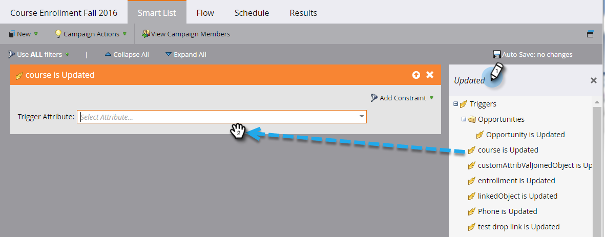

# Déclencher des modifications d’objet personnalisé {#trigger-off-custom-object-changes}

>[!NOTE]
>
>Cette fonctionnalité est disponible uniquement :
>
>* À utiliser uniquement avec des objets personnalisés Marketo, et non avec des objets personnalisés synchronisés par le biais de l’intégration native [!DNL Salesforce] ou [!DNL Microsoft Dynamics]
>
>* Comme déclencheur, pas comme filtre
>
>Contactez l’assistance Marketo [&#128279;](https://nation.marketo.com/t5/Support/ct-p/Support) pour activer les déclencheurs de changement d’objet personnalisé.

Dans la liste dynamique d’une campagne dynamique, vous pouvez déclencher une action de flux lorsqu’un objet personnalisé est ajouté à une personne ou à une entreprise. Vous pouvez également créer une liste dynamique qui utilise une _modification_ dans un objet personnalisé comme déclencheur. Par exemple, utilisez-le pour envoyer un e-mail lorsqu’un nom de cours est mis à jour.

>[!NOTE]
>
>Une entrée de journal d’activité n’est pas créée lorsqu’un enregistrement d’objet personnalisé est modifié.

1. Dans Marketo Engage, accédez à **[!UICONTROL Activités marketing]**.

   

1. Créez ou ouvrez une campagne dynamique existante, puis sélectionnez la liste dynamique.

   

1. Recherchez le déclencheur dont vous avez besoin et faites-le glisser sur la zone de travail.

   

1. Sélectionnez l’attribut [!UICONTROL trigger].

   

1. Vous pouvez éventuellement définir une contrainte.

   

1. La modification est automatiquement enregistrée.

   

   >[!NOTE]
   >
   >* [Créer une liste dynamique](/help/marketo/product-docs/core-marketo-concepts/smart-lists-and-static-lists/creating-a-smart-list/create-a-smart-list.md)
   >* [Présentation des objets personnalisés Marketo](/help/marketo/product-docs/administration/marketo-custom-objects/understanding-marketo-custom-objects.md)
