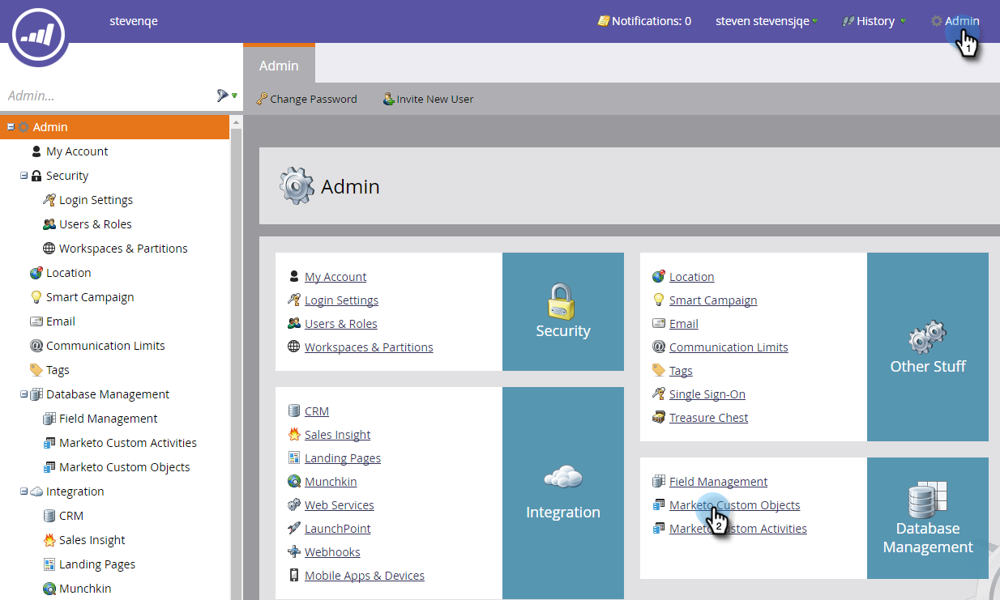

# Présentation des objets personnalisés de marketing {#understanding-marketo-custom-objects}

Utilisez des objets personnalisés pour effectuer le suivi de mesures spécifiques à votre entreprise.

>[!NOTE]
>
>**Disponibilité**
>
>Tous les clients n’ont pas acheté cette fonctionnalité. Contactez votre représentant commercial pour plus de détails.

Utilisez des objets personnalisés comme filtres et déclencheurs dans vos campagnes dynamiques. Par exemple :

* **Filtre** : Envoyer des e-mails uniquement aux propriétaires d&#39;une marque spécifique de véhicule
* **Déclencheur** : Envoyez un courrier électronique lorsqu’un objet personnalisé est ajouté à une personne ou une société.

Vous pouvez configurer des objets personnalisés dans une relation de type &quot;un à plusieurs&quot; ou &quot;plusieurs à plusieurs&quot;. Par exemple :

* **Un à plusieurs** : Une personne possède plusieurs voitures
* **Plusieurs à plusieurs** : Plusieurs étudiants sont inscrits à plusieurs cours à partir d&#39;un catalogue de cours

Une structure de type &quot;un à plusieurs&quot; utilise un seul champ de lien pour connecter l’objet personnalisé à une personne ou une société.

Plusieurs à plusieurs objets personnalisés utilisent deux champs de lien, faisant partie d’un objet intermédiaire. Un champ Lien est connecté à la personne ou à la société et un autre à l’objet personnalisé, tel que le catalogue de cours. Cet objet intermédiaire peut contenir des champs personnalisés supplémentaires, tels qu&#39;un niveau de cours ou une date de présence, ce qui définit davantage la nature de la connexion.

>[!TIP]
>
>Importez des objets personnalisés à l’aide de valeurs CSV (valeurs séparées par des virgules) dans l’interface utilisateur afin de tester et de valider un exemple de données. Ensuite, téléchargez tous vos fichiers avec une API.

>[!CAUTION]
>
>Vous ne pouvez pas restaurer des objets personnalisés. Veillez donc à ne plus en avoir besoin avant de les supprimer.

## Accès aux objets personnalisés de marketing {#accessing-marketo-custom-objects}

1. Pour créer ou modifier des objets personnalisés de Marketo, cliquez sur **Admin **puis sur le lien **Objet personnalisé du marketing** s.

   

1. Les objets personnalisés du marketing affichent tous vos objets personnalisés sur la droite, mais uniquement les objets approuvés dans la grille principale.

   

1. La grille affiche le nom de l’objet, le nombre d’enregistrements, le nombre de champs et la date de la mise à jour la plus récente.

   >[!TIP]
   >
   >Marketo met automatiquement à jour ces champs, mais vous pouvez actualiser l’affichage en cliquant sur l’icône de la colonne Enregistrements.

1. Cliquez sur le nom de l’objet sur la droite pour ouvrir la page de détails.

   

## Vue d&#39;objets personnalisés associés à une personne {#view-custom-objects-associated-to-a-person}

Après avoir créé la structure d’objets personnalisés, lorsque vous téléchargez les données d’objets personnalisés spécifiques, les objets personnalisés sont automatiquement associés aux personnes de la base de données à l’aide du champ de lien dans l’objet personnalisé. Vous pouvez vue des informations à partir de l’onglet Objets personnalisés sur la page Détails de la personne.

1. Accédez à **Base de données**.

   

1. Ouvrez votre base de données et cliquez sur l’onglet **Personnes**. Cliquez avec le doublon sur l’enregistrement d’une personne que vous avez associée à un objet personnalisé.

   

1. Sur la page des détails de la personne, cliquez sur l&#39;onglet **Objets personnalisés**. Sélectionnez l’objet dans la liste déroulante.

   

1. Vous pouvez maintenant vue une liste de tous les objets personnalisés de ce type qui sont associés à cette personne.

   

## Utilisation d’objets personnalisés avec des Sociétés {#using-custom-objects-with-companies}

Un objet personnalisé lié à la société fonctionne mieux si vous synchronisez les sociétés à partir de la gestion de la relation client ou si vous créez explicitement des sociétés à l’aide de l’API. Nous vous recommandons également d’utiliser l’ID de Société comme champ de lien.

Si plusieurs personnes dans Marketo sont des enregistrements dans les enregistrements CRM ou Marketo uniquement, un objet personnalisé lié à une société ne sera pas associé à plusieurs enregistrements individuels. Cela est dû au fait qu’une société comportant plusieurs personnes est prise en charge uniquement lorsque des sociétés sont synchronisées à partir de la gestion de la relation client ou si vous utilisez une API pour créer explicitement des sociétés.

Les objets personnalisés ne peuvent être directement liés qu’à un seul enregistrement. Cela signifie que lorsque votre type d’objet personnalisé est lié par champ de société, vous devez vous assurer que les enregistrements de votre personne sont associés à une société en utilisant la conversion des contacts dans votre gestion de la relation client ou en utilisant le champ externeCompanyId, si vous gérez des sociétés à l’aide des API REST de Marketo. Pour les enregistrements de personne qui ne sont pas explicitement liés à des enregistrements de société, les objets personnalisés liés à l’aide de la société sont liés de manière aléatoire à un enregistrement unique, même si la valeur du champ de société est partagée par de nombreuses personnes.

Voir [Importer des données d’objet personnalisé](import-custom-object-data.md) pour plus d’informations.

>[!MORELIKETHIS]
>
>* [Créer des objets personnalisés marketing](create-marketo-custom-objects.md)
>* [Approuver un objet personnalisé](approve-a-custom-object.md)
>* [Modifier et supprimer un objet personnalisé marketing](edit-and-delete-a-marketo-custom-object.md)
>* [Ajouter les champs d&#39;objet personnalisé Marketo](add-marketo-custom-object-fields.md)
>* [Modifier et supprimer des champs d&#39;objet personnalisé du marketing](edit-and-delete-marketo-custom-object-fields.md)
>* [Importer des données d’objet personnalisées](import-custom-object-data.md)

>

