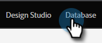
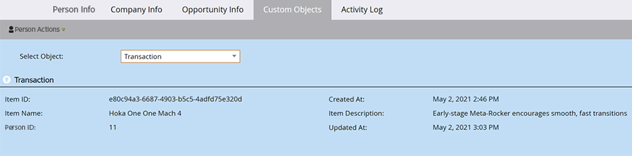

# Présentation des objets personnalisés Marketo {#understanding-marketo-custom-objects}

Utilisez des objets personnalisés pour effectuer le suivi des mesures spécifiques à votre entreprise.

>[!AVAILABILITY]
>
>Tous les utilisateurs de Marketo Engage n’ont pas acheté cette fonctionnalité. Pour plus d’informations, contactez l’équipe du compte Adobe (votre gestionnaire de compte).

Utilisez des objets personnalisés comme filtres et triggers dans vos campagnes intelligentes. Par exemple :

* **Filtrer** : envoyez des e-mails uniquement aux propriétaires d’une marque de véhicule spécifique.
* **Déclencheur** : envoyez un e-mail lorsqu’un objet personnalisé est ajouté à une personne ou à une entreprise.

Vous pouvez configurer des objets personnalisés dans une relation de type « un à plusieurs » ou « plusieurs à plusieurs ». Par exemple :

* **Un à plusieurs** : une personne possède plusieurs voitures
* **Plusieurs-à-plusieurs** : plusieurs étudiants sont inscrits à plusieurs cours d’un catalogue de cours

Une structure de type « un à plusieurs » utilise un champ de lien unique pour connecter l’objet personnalisé à une personne ou à une entreprise.

Les objets personnalisés multiples-à-multiples utilisent deux champs de lien, faisant partie d’un objet intermédiaire. Un champ Lien est connecté à la personne ou à la société et un autre est connecté à l’objet personnalisé, tel que le catalogue de cours. Cet objet intermédiaire peut contenir d’autres champs personnalisés, tels qu’un niveau de cours ou une date de présence, ce qui définit davantage la nature de la connexion.

>[!TIP]
>
>Importez des objets personnalisés à l’aide de valeurs séparées par des virgules (CSV) dans l’interface utilisateur pour tester et valider un exemple de données. Ensuite, chargez tous vos fichiers avec une API.

>[!CAUTION]
>
>Vous ne pouvez pas restaurer d&#39;objets personnalisés. Assurez-vous donc de ne plus en avoir besoin avant de les supprimer.

## Accès aux objets personnalisés Marketo {#accessing-marketo-custom-objects}

1. Accédez à la zone **[!UICONTROL Admin]**.

   

1. Cliquez sur **[!UICONTROL Objets personnalisés Marketo]**.

   

1. L’affichage Objets personnalisés de Marketo répertorie tous vos objets personnalisés sur la droite, mais uniquement les objets approuvés dans la grille principale.

   

   >[!NOTE]
   >
   >La grille affiche le nom de l’objet, le nombre d’enregistrements, le nombre de champs et la date de la mise à jour la plus récente.

   >[!TIP]
   >
   >Marketo met automatiquement à jour ces champs, mais vous pouvez actualiser l’affichage en cliquant sur l’icône dans la colonne Enregistrements .

1. Cliquez sur le nom de l’objet sur la droite pour ouvrir la page de détails.

   

## Afficher les objets personnalisés associés à une personne {#view-custom-objects-associated-to-a-person}

Après avoir créé la structure d’objet personnalisée, lorsque vous chargez les données d’objet personnalisé spécifiques, les objets personnalisés sont automatiquement associés aux personnes dans la base de données à l’aide du champ lien dans l’objet personnalisé. Vous pouvez afficher des informations à partir de l’onglet [!UICONTROL Objets personnalisés] sur la page des détails de la personne.

1. Accédez à **[!UICONTROL Base de données]**.

   

1. Ouvrez votre base de données et cliquez sur l’onglet **[!UICONTROL Personnes]**. Double-cliquez sur l’enregistrement d’une personne que vous avez associée à un objet personnalisé.

   

1. Sur la page des détails de la personne, cliquez sur l’onglet **[!UICONTROL Objets personnalisés]**. Sélectionnez l’objet dans la liste déroulante.

   

1. Vous pouvez désormais afficher une liste de tous les objets personnalisés de ce type qui sont associés à cette personne.

   

   >[!NOTE]
   >
   >Dans un enregistrement de personne, l’onglet Objet personnalisé peut afficher un maximum de 100 enregistrements, triés par ID dans l’ordre décroissant.

## Utilisation d’objets personnalisés avec des sociétés {#using-custom-objects-with-companies}

Un objet personnalisé lié à l’entreprise fonctionne mieux si vous synchronisez les entreprises à partir du CRM ou si vous créez explicitement des entreprises à l’aide de l’API. Nous vous recommandons également d’utiliser l’ID d’entreprise comme champ de lien.

Si plusieurs personnes dans Marketo sont des enregistrements dans le CRM ou dans Marketo uniquement, un objet personnalisé lié à une société ne sera pas associé à plusieurs enregistrements individuels. Cela est dû au fait qu’une entreprise comprenant plusieurs personnes est prise en charge uniquement lorsque les entreprises sont synchronisées à partir du CRM ou si vous utilisez une API pour créer explicitement des entreprises.

Les objets personnalisés ne peuvent être liés directement qu’à un seul enregistrement. Cela signifie que lorsque votre type d’objet personnalisé est lié par un champ société, vous devez vous assurer que les enregistrements de votre personne sont associés à une société à l’aide de la conversion de contacts dans votre CRM ou à l’aide du champ externalCompanyId si vous gérez des sociétés à l’aide d’API REST Marketo. Pour les enregistrements de personne qui ne sont pas explicitement liés aux enregistrements d’entreprise, les objets personnalisés liés à l’aide de l’option entreprise seront aléatoirement liés à un seul enregistrement, même si la valeur du champ entreprise est partagée par de nombreuses personnes.

Voir [Importer des données d’objet personnalisé](/help/marketo/product-docs/administration/marketo-custom-objects/import-custom-object-data.md) pour plus d’informations.

>[!MORELIKETHIS]
>
>* [Créer des objets personnalisés Marketo](/help/marketo/product-docs/administration/marketo-custom-objects/create-marketo-custom-objects.md)
>* [Approuver un objet personnalisé](/help/marketo/product-docs/administration/marketo-custom-objects/approve-a-custom-object.md)
>* [Modifier et supprimer un objet personnalisé Marketo](/help/marketo/product-docs/administration/marketo-custom-objects/edit-and-delete-a-marketo-custom-object.md)
>* [Ajouter des champs d’objet personnalisés Marketo](/help/marketo/product-docs/administration/marketo-custom-objects/add-marketo-custom-object-fields.md)
>* [Modifier et supprimer des champs d’objet personnalisés Marketo](/help/marketo/product-docs/administration/marketo-custom-objects/edit-and-delete-marketo-custom-object-fields.md)
>* [Importer des données d’objet personnalisées](/help/marketo/product-docs/administration/marketo-custom-objects/import-custom-object-data.md)
