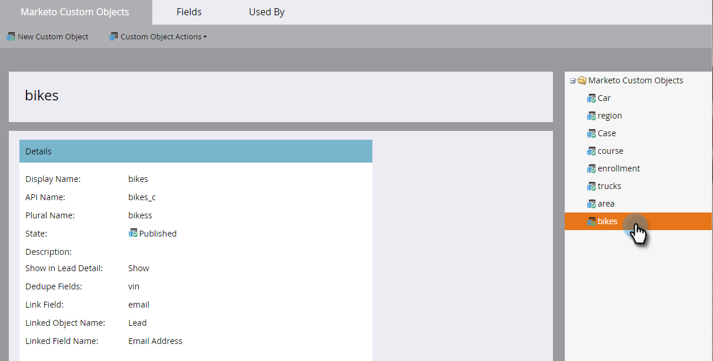

# Présentation des objets personnalisés Marketo {#understanding-marketo-custom-objects}

Utilisez des objets personnalisés pour effectuer le suivi de mesures propres à votre entreprise.

>[!AVAILABILITY]
>
>Tous les utilisateurs de Marketo Engage n’ont pas acheté cette fonctionnalité. Pour plus d’informations, contactez l’équipe du compte d’Adobe (votre gestionnaire de compte).

Utilisez des objets personnalisés comme filtres et déclencheurs dans vos campagnes dynamiques. Par exemple :

* **Filtre** : envoyer des emails uniquement aux propriétaires d’une marque de véhicule spécifique
* **Déclencheur** : envoyez un email lorsqu’un objet personnalisé est ajouté à une personne ou à une entreprise.

Vous pouvez configurer des objets personnalisés dans une relation un-à-plusieurs ou plusieurs-à-plusieurs. Par exemple :

* **Un à plusieurs** : une personne possède plusieurs voitures
* **Multiple-à-multiple** : plusieurs étudiants sont inscrits à plusieurs cours depuis un catalogue de cours

Une structure de type &quot;un à plusieurs&quot; utilise un champ de lien unique pour connecter l’objet personnalisé à une personne ou à une entreprise.

Plusieurs à plusieurs objets personnalisés utilisent deux champs de lien, faisant partie d’un objet intermédiaire. Un champ Lien est connecté à la personne ou à la société et un autre est connecté à l’objet personnalisé, tel que le catalogue de cours. Cet objet intermédiaire peut contenir des champs personnalisés supplémentaires, tels qu’un niveau de cours ou une date de présence, ce qui définit davantage la nature de la connexion.

>[!TIP]
>
>Importez des objets personnalisés à l’aide de valeurs séparées par des virgules (CSV) dans l’interface utilisateur pour tester et valider un exemple de données. Ensuite, téléchargez tous vos fichiers avec une API.

>[!CAUTION]
>
>Vous ne pouvez pas restaurer des objets personnalisés. Veillez donc à ne plus en avoir besoin avant de les supprimer.

## Accès aux objets personnalisés de Marketo {#accessing-marketo-custom-objects}

1. Accédez à la zone **[!UICONTROL Admin]**.

   

1. Cliquez sur **[!UICONTROL Marketo Custom Objects]**.

   

1. L’affichage Objets personnalisés Marketo répertorie tous vos objets personnalisés à droite, mais uniquement ceux approuvés dans la grille principale.

   

   >[!NOTE]
   >
   >La grille affiche le nom de l’objet, le nombre d’enregistrements, le nombre de champs et la date de la mise à jour la plus récente.

   >[!TIP]
   >
   >Marketo met automatiquement à jour ces champs, mais vous pouvez actualiser l’affichage en cliquant sur l’icône dans la colonne Enregistrements .

1. Cliquez sur le nom de l’objet à droite pour ouvrir la page de détails.

   

## Affichage des objets personnalisés associés à une personne {#view-custom-objects-associated-to-a-person}

Après avoir créé la structure d’objet personnalisé, lorsque vous chargez les données d’objet personnalisé spécifiques, les objets personnalisés sont automatiquement associés aux personnes dans la base de données à l’aide du champ de lien de l’objet personnalisé. Vous pouvez afficher des informations à partir de l’onglet [!UICONTROL Objets personnalisés] sur la page de détails de la personne.

1. Accédez à **[!UICONTROL Base de données]**.

   

1. Ouvrez votre base de données et cliquez sur l’onglet **[!UICONTROL Personnes]** . Double-cliquez sur l’enregistrement d’une personne que vous avez associée à un objet personnalisé.

   

1. Sur la page des détails de la personne, cliquez sur l’onglet **[!UICONTROL Objets personnalisés]** . Sélectionnez l’objet dans la liste déroulante.

   

1. Vous pouvez désormais afficher la liste de tous les objets personnalisés de ce type qui sont associés à cette personne.

   

## Utilisation d’objets personnalisés avec des entreprises {#using-custom-objects-with-companies}

Un objet personnalisé lié à l’entreprise fonctionne mieux si vous synchronisez les entreprises à partir du CRM ou si vous créez explicitement des entreprises à l’aide de l’API. Nous vous recommandons également d’utiliser l’ID de société comme champ de lien.

Si plusieurs personnes dans Marketo sont des enregistrements dans les enregistrements CRM ou Marketo uniquement, un objet personnalisé lié à une entreprise ne sera pas associé à plusieurs enregistrements individuels. Cela est dû au fait qu’une société comptant plusieurs personnes en-dessous est prise en charge uniquement lorsque les entreprises sont synchronisées à partir du CRM ou si vous utilisez une API pour créer explicitement des entreprises.

Les objets personnalisés ne peuvent être associés directement qu’à un seul enregistrement. Cela signifie que lorsque votre type d’objet personnalisé est lié par champ d’entreprise, vous devez vous assurer que vos enregistrements de personne sont associés à une entreprise à l’aide de la conversion de contact dans votre CRM ou à l’aide du champ externalCompanyId si vous gérez des entreprises à l’aide des API REST Marketo. Pour les enregistrements de personne qui ne sont pas liés explicitement aux enregistrements de l’entreprise, les objets personnalisés liés à l’aide de l’entreprise sont liés de manière aléatoire à un seul enregistrement, même si la valeur du champ de l’entreprise est partagée par de nombreuses personnes.

Pour plus d’informations, voir [Importer des données d’objet personnalisé](/help/marketo/product-docs/administration/marketo-custom-objects/import-custom-object-data.md) .

>[!MORELIKETHIS]
>
>* [Créer des objets personnalisés Marketo](/help/marketo/product-docs/administration/marketo-custom-objects/create-marketo-custom-objects.md)
>* [Approuver un objet personnalisé](/help/marketo/product-docs/administration/marketo-custom-objects/approve-a-custom-object.md)
>* [Modifier et supprimer un objet personnalisé Marketo](/help/marketo/product-docs/administration/marketo-custom-objects/edit-and-delete-a-marketo-custom-object.md)
>* [Ajouter des champs d’objet personnalisés Marketo](/help/marketo/product-docs/administration/marketo-custom-objects/add-marketo-custom-object-fields.md)
>* [Modifier et supprimer des champs d’objet personnalisés Marketo](/help/marketo/product-docs/administration/marketo-custom-objects/edit-and-delete-marketo-custom-object-fields.md)
>* [Importer des données d’objet personnalisées](/help/marketo/product-docs/administration/marketo-custom-objects/import-custom-object-data.md)
