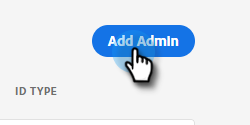
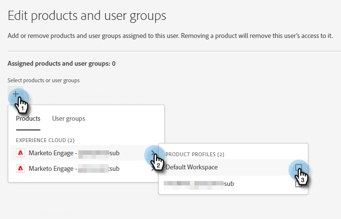

# Ajout ou suppression d’un administrateur de produit {#add-or-remove-a-product-admin}

>[!NOTE]
>
>**Système** Les administrateurs ne sont créés qu’au niveau de l’organisation Adobe. Si vous pensez que vous avez besoin de plus d’une personne, veuillez contacter [Prise en charge de Marketo](https://nation.marketo.com/t5/support/ct-p/Support).

## Ajout d’un administrateur de produit {#add-a-product-admin}

1. Connectez-vous au [Adobe Admin Console](https://adminconsole.adobe.com/).

   

1. Cliquez sur **Marketo Engage**.

   

1. Sélectionnez l’abonnement souhaité (si vous en avez plusieurs).

   

1. Cliquez sur le bouton **Administrateurs** .

   

1. Cliquez sur le bouton **Ajouter un administrateur** bouton .

   

1. Entrez l’adresse électronique ou le nom d’utilisateur de l’administrateur que vous souhaitez ajouter. Prénom et nom sont facultatifs. Cliquez sur **Enregistrer**.

   

1. Cliquez sur le nom de l’administrateur que vous venez d’ajouter.

   

1. Sous Produits, cliquez sur le menu à trois points et sélectionnez **Modifier**.

   

1. Cliquez sur le bouton **+** signe. Cliquez sur le chevron en regard de l’abonnement de Marketo Engage souhaité (s’il en existe plusieurs) et sélectionnez le profil de produit souhaité.

   

1. Cliquez sur **Enregistrer**.

   

L’utilisateur recevra alors deux e-mails. Le premier courrier électronique les informe qu’ils ont reçu des droits d’administrateur de produit pour Marketo Engage. Le deuxième email les invite à se connecter à Marketo Engage.

>[!NOTE]
>
>Lorsque l’utilisateur administrateur de produit est ajouté au Marketo Engage via Adobe Admin Console, il se voit attribuer le rôle d’ administrateur de produit Adobe dans l’abonnement.

## Suppression d’un administrateur {#remove-a-user}

1. Connectez-vous au [Adobe Admin Console](https://adminconsole.adobe.com/).

   

1. Cliquez sur **Marketo Engage**.

   

1. Sélectionnez l’abonnement souhaité (si vous en avez plusieurs).

   

1. Cliquez sur le bouton **Administrateurs** .

   

1. Sélectionnez l’administrateur à supprimer, puis cliquez sur le bouton **Supprimer l’administrateur** bouton .

   

1. Cliquez sur **Supprimer l’administrateur** pour confirmer.

   

L’utilisateur reçoit alors un e-mail lui indiquant qu’il n’a plus accès à Marketo Engage en tant qu’administrateur de produit.
