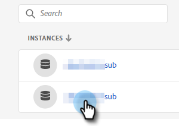

# Ajout ou suppression d’un utilisateur {#add-or-remove-a-user}

## Ajout d’un utilisateur {#add-a-user}

1. Connectez-vous à [Adobe Admin Console](https://adminconsole.adobe.com/){target="_blank"}.

   

1. Cliquez sur **Marketo Engage**.

   

1. Sélectionnez un abonnement (si vous en avez plusieurs).

   

1. Cliquez sur l’onglet **[!UICONTROL Utilisateurs]** .

   

1. Cliquez sur le bouton **[!UICONTROL Ajouter un utilisateur]** .

   

1. Saisissez le nom, le groupe d’utilisateurs ou l’adresse électronique de l’utilisateur que vous souhaitez ajouter. Prénom et nom sont facultatifs.

   

1. Cliquez sur l’icône **+** et sélectionnez le profil de produit souhaité.

   

   >[!IMPORTANT]
   >
   >Un utilisateur _doit_ être ajouté à un profil de produit pour accéder à Marketo Engage.

1. Cliquez sur **[!UICONTROL Enregistrer]**.

   

L’utilisateur recevra alors un e-mail pour se connecter à Marketo Engage.

>[!NOTE]
>
>Lorsque l’utilisateur est ajouté au Marketo Engage via Adobe Admin Console, il se voit attribuer le rôle &quot;Utilisateur standard&quot; dans l’espace de travail par défaut de l’abonnement. Si le rôle de l’utilisateur dans l’espace de travail doit être ajusté, cela se fait dans Marketo Engage, [ comme décrit ici](/help/marketo/product-docs/administration/users-and-roles/managing-user-roles-and-permissions.md){target="_blank"}.

## Suppression d’un utilisateur {#remove-a-user}

>[!NOTE]
>
>Pour supprimer un utilisateur, vous devez être un administrateur système.

1. Connectez-vous à [Adobe Admin Console](https://adminconsole.adobe.com/){target="_blank"}.

   

1. Cliquez sur **Marketo Engage**.

   

1. Sélectionnez un abonnement (si vous en avez plusieurs).

   

1. Cliquez sur l’onglet **[!UICONTROL Utilisateurs]** .

   

1. Sélectionnez l’utilisateur à supprimer et cliquez sur le bouton **[!UICONTROL Supprimer]** .

   

1. Cliquez sur **[!UICONTROL Supprimer l’utilisateur]** pour confirmer.

   

L’utilisateur recevra alors un e-mail l’informant qu’il n’a plus accès au Marketo Engage.

>[!MORELIKETHIS]
>
>* [Utilisateurs de Adobe Admin Console](https://helpx.adobe.com/fr/enterprise/using/users.html){target="_blank"}
>* [Gérer les utilisateurs individuellement](https://helpx.adobe.com/fr/enterprise/using/manage-users-individually.html){target="_blank"}
