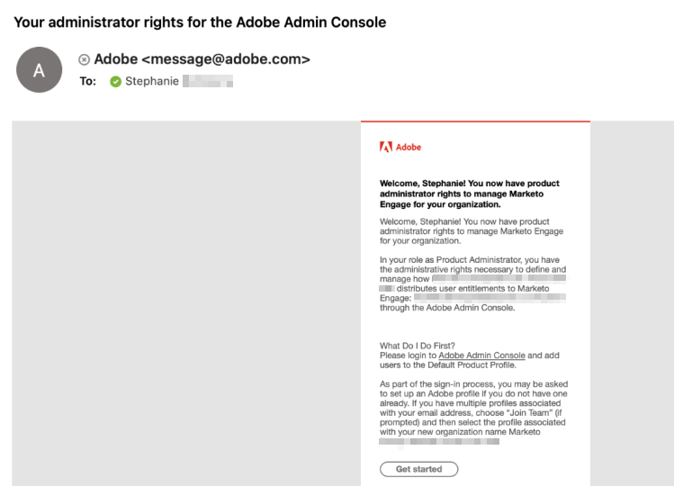
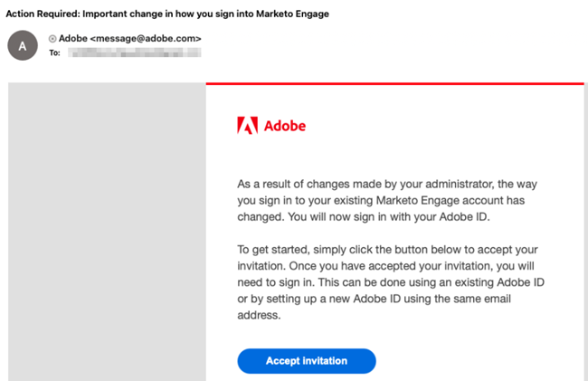
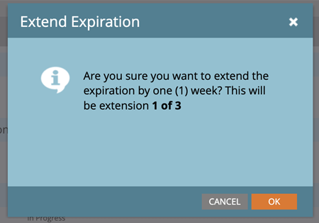
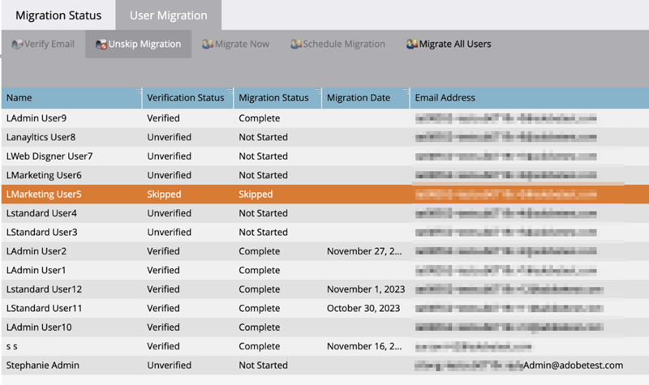
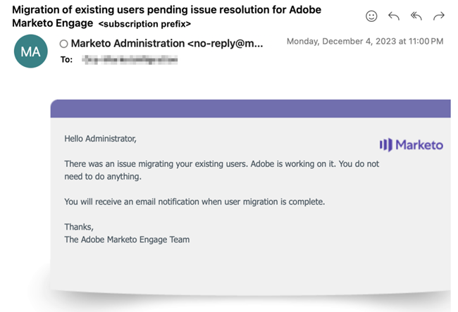
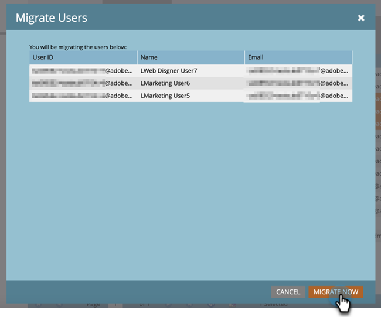
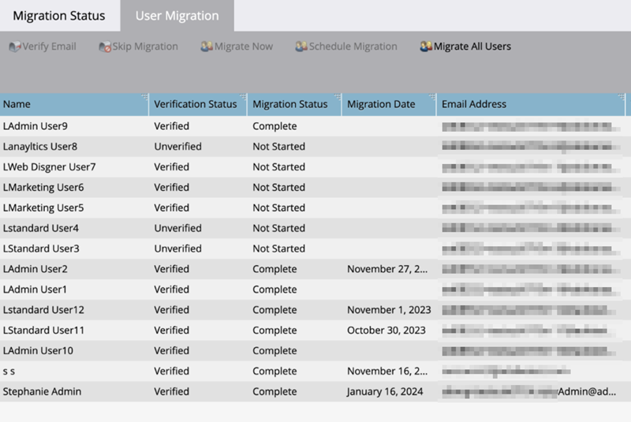
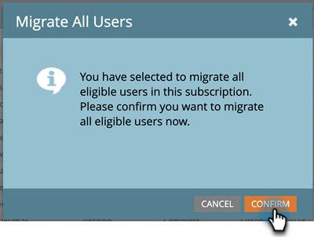

# Migration vers Adobe Identity {#migrating-to-adobe-identity}

Lorsqu’Adobe planifie la migration des utilisateurs et utilisatrices d’un abonnement, les administrateurs et administratrices de produit Marketo Engage ont accès à la console de migration qui se trouve dans le menu de navigation de la zone Admin sous Intégration.

## Pré-migration {#pre-migration}

Avant le début de la migration, un administrateur ou une administratrice peut modifier la date de début de la migration des utilisateurs et utilisatrices pour leurs abonnements en accédant à l’écran Pré-migration dans la console de migration. Pour modifier la date, l’administrateur ou l’administratrice peut cliquer sur le bouton **Modifier**.

L’administrateur ou l’administratrice peut choisir une date comprise dans une plage de 8 à 30 jours à venir. Lorsqu’une date est sélectionnée, l’administrateur ou l’administratrice doit cliquer sur **Enregistrer** pour apporter la modification.

>[!NOTE]
>
>Pour demander une date antérieure à 8 jours ou ultérieure à 30, ou si vous devez ajuster la date après le verrouillage de la console de pré-migration, envoyez un e-mail à l’adresse `marketocares@marketo.com`.

## Migrations vers Adobe Identity {#migrations-to-adobe-identity}

Tous les abonnements Marketo avec un fuseau horaire des États-Unis seront migrés à partir de minuit, heure standard du Pacifique, à la date de début de la migration des utilisateurs et utilisatrices. La migration des utilisateurs et utilisatrices pour tous les autres abonnements commencera à minuit dans le fuseau horaire spécifié par l’abonnement. Lorsque la migration des utilisateurs et utilisatrices d’un abonnement commence, la gestion des utilisateurs et utilisatrices n’est plus disponible dans la zone d’administration de Marketo. Elle est uniquement disponible dans Adobe Admin Console. La gestion des rôles reste dans l’onglet Utilisateurs, utilisatrices et rôles de la zone d’administration de Marketo, ainsi que dans la gestion des utilisateurs et utilisatrices locaux (API uniquement).

Adobe migre automatiquement tous les administrateurs et administratrices Marketo (ayant un rôle d’administration standard) avec les e-mails vérifiés en premier. Lorsque les administrateurs et administratrices Marketo sont migrés vers Adobe Identity, ils sont ajoutés à l’Adobe Admin Console de l’abonnement en tant qu’administrateurs et administratrices de produit pour l’abonnement Marketo et se voient attribuer le rôle d’administration de produit Adobe dans l’application Marketo (ainsi que tout autre rôle qu’ils avaient précédemment) et leur Adobe ID est autorisé pour l’abonnement. Les administrateurs et administratrices recevront deux e-mails. L’un indique l’affectation en tant qu’administrateur ou administratrice de produit Admin Console et l’autre indique que son Adobe ID a accès au produit Marketo.

>[!IMPORTANT]
>
>Vous devez cliquer sur le bouton **Accepter l’invitation** dans l’e-mail d’octroi de droit pour accéder à Marketo Engage avec votre Adobe ID.

**E-mail d’administrateur ou administratrice du produit Marketo**

**E-mail d’octroi de droit Marketo**

**Si votre abonnement Marketo ne dispose pas de l’authentification unique dans Marketo et/ou votre organisation Adobe**, Adobe migre automatiquement le reste de vos utilisateurs et utilisatrices. Ce workflow vise à fournir le niveau d’automatisation le plus élevé possible et aucune action n’est requise pour exécuter la migration. Une fois la migration terminée, la console de migration Marketo n’apparaît plus dans la zone de navigation d’administration de Marketo et tous les utilisateurs et utilisatrices accèdent à Marketo à l’aide d’un Adobe ID.

**Si votre abonnement Marketo dispose d’une authentification unique dans Marketo et/ou votre organisation Adobe**, les administrateurs et administratrices Marketo auront accès à l’outil de migration des utilisateurs et utilisatrices en libre-service de la console de migration au début de la migration des utilisateurs et utilisatrices et seront alertés via une bannière lors de la connexion sur la page Mon Marketo. L’administrateur ou administratrice devra effectuer la migration des utilisateurs et utilisatrices à l’aide de l’outil de migration des utilisateurs et utilisatrices en libre-service.

## Migration des utilisateurs et utilisatrices en libre-service Marketo {#marketo-self-service-user-migration}

L’outil Console de migration des utilisateurs et utilisatrices en libre-service de Marketo se compose de deux onglets.

* **Onglet Statut de la migration**
* **Onglet Migration des utilisateurs et utilisatrices**

Trois étapes principales sont requises pour effectuer une migration en libre-service.

1. Effectuez la migration de tous les utilisateurs et utilisatrices admissibles vérifiés par e-mail (onglet Migration des utilisateurs et utilisatrices).
1. Ignorez tous les utilisateurs et utilisatrices non éligibles et ceux qui sont éligibles mais indésirables (onglet Migration des utilisateurs et utilisatrices).
1. Une fois les étapes 1 et 2 terminées, confirmez la migration (onglet Statut de la migration).

### Onglet Statut de la migration {#migration-status-tab}

L’onglet Statut de la migration fournit des mesures globales sur la progression de la condition préalable de vérification des e-mails, la migration et l’activation des utilisateurs et utilisatrices, ainsi que l’achèvement de la migration des abonnements.

En haut de l’onglet Statut de la migration, l’expiration de la migration des abonnements et le bouton permettant d’étendre l’expiration s’affichent. Vous trouverez plus d’informations sur l’expiration de la migration dans la [section Expiration de la migration des utilisateurs et utilisatrices](#user-migration-expiration).

La section suivante de l’onglet Statut de la migration comporte deux barres de progression. La première barre de progression permet d’afficher la progression de la vérification des e-mails des utilisateurs et utilisatrices. La deuxième barre de progression permet d’afficher l’avancement de la migration des utilisateurs et utilisatrices.

Trois sections du statut s’affichent ensuite pour l’administrateur ou l’administratrice.

* **Vérification des e-mails des utilisateurs et utilisatrices** : statut de vérification des utilisateurs et utilisatrices dans l’abonnement.
* **Migration et activation des utilisateurs et utilisatrices** : statut de migration et d’activation (migration et droit au produit Marketo Engage) des utilisateurs et utilisatrices au sein de l’abonnement.
* **Confirmation de migration** : statut d’achèvement de la migration de l’abonnement.

#### Vérification des e-mails des utilisateurs et utilisatrices {#user-email-verification}

Dans la section Vérification des e-mails des utilisateurs et utilisatrices, un administrateur ou une administratrice peut consulter le statut actuel de la vérification des e-mails des utilisateurs et utilisatrices dans l’abonnement, avant la migration vers Adobe Identity.

Un administrateur ou une administratrice peut afficher l’état de vérification de l’abonnement par e-mail, le pourcentage d’utilisateurs et d’utilisatrices de l’abonnement qui ont terminé la vérification par e-mail et le nombre d’utilisateurs et d’utilisatrices qui ont été marqués comme ignorés. Le statut sera signalé lors de l’état de vérification des e-mails de tous les utilisateurs et utilisatrices dans l’abonnement. L’administrateur ou l’administratrice peut cliquer sur le nombre d’utilisateurs et d’utilisatrices ignorés et accède à l’onglet Migration des utilisateurs et utilisatrices pour afficher ceux qui ont été ignorés.

L’e-mail de vérification peut être envoyé par un administrateur ou une administratrice dans l’onglet Migration des utilisateurs et utilisatrices de la console de migration et l’onglet Utilisateur, utilisatrice et rôles dans la zone Admin de Marketo, par l’utilisateur ou par l’utilisatrice dans les paramètres de son compte. Comme pour les e-mails d’invitation d’utilisateur ou d’utilisatrice, le lien contenu dans l’e-mail de vérification expire sous 3 jours. Vous trouverez plus d’informations sur la vérification des e-mails dans la [Communauté](https://nation.marketo.com/) et dans la [documentation sur la vérification des e-mails](/help/marketo/product-docs/administration/users-and-roles/email-verification.md).

>[!IMPORTANT]
>
>Si une personne utilisant Marketo Engage ne vérifie pas son adresse e-mail, elle ne peut pas être migrée vers un Adobe ID et perdra l’accès à l’abonnement Marketo une fois la migration terminée. Pour récupérer l’accès, un administrateur ou une administratrice de produit Marketo doit l’ajouter en tant que nouvel utilisateur ou nouvelle utilisatrice.

#### Migration et activation des utilisateurs et utilisatrices {#user-migration-and-activation}

Dans la section Migration et activation des utilisateurs et utilisatrices, un administrateur ou une administratrice peut consulter l’état actuel de la migration totale des utilisateurs et utilisatrices et des droits d’accès au système Adobe Identity Management.

Un administrateur ou une administratrice peut afficher le pourcentage d’utilisateurs et d’utilisatrices dans leur abonnement qui ont été migrés vers un Adobe ID ou marqués comme Ignorés. Le statut sera signalé sur le statut de migration de tous les utilisateurs et utilisatrices vers un Adobe ID dans l’abonnement, ou marqué comme Ignoré et ne sera pas migré. À mesure que les utilisateurs et utilisatrices sont migrés et autorisés à accéder à Marketo Engage, ou ignorés, ce statut est mis à jour.

#### Confirmation de migration {#migration-confirmation}

Dans la section Confirmation de la migration, un administrateur ou une administratrice devra confirmer que la migration des utilisateurs et utilisatrices est terminée pour l’abonnement.

Une fois que tous les utilisateurs et utilisatrices de l’abonnement sont comptabilisés (migrés ou ignorés), le bouton « Terminer la migration » s’affiche.

L’administrateur ou l’administratrice en charge de la migration doit accepter la confirmation de migration en cliquant sur le bouton **Terminer la migration**. Il faudra ensuite appuyer sur **Confirmer**.

Une fois la fin de la migration des utilisateurs et utilisatrices confirmée, la console de migration est supprimée du menu de navigation d’administration.

### Expiration de la migration des utilisateurs et utilisatrices {#user-migration-expiration}

Adobe exige que les clientes et clients effectuent les migrations en libre-service dans les 30 jours. Il n’y aura pas de blocage de la migration des utilisateurs et utilisatrices ou de l’achèvement de la migration par les administrateurs et administratrices si la date d’expiration est dépassée. Cependant, ils pourront uniquement migrer les utilisateurs et utilisatrices à la demande. Si les administrateurs et administratrices ont besoin de plus de temps, ils peuvent prolonger la date d’expiration de l’abonnement.

Lorsque vous cliquez sur le bouton **Prolonger l’expiration**, la date est mise à jour une semaine plus tard. Les administrateurs et administratrices peuvent prolonger la date d’expiration jusqu’à trois fois.

Adobe vous contactera si vous n’avez pas terminé la migration à la date d’expiration.

### Onglet Migration des utilisateurs et utilisatrices {#user-migration-tab}

L’onglet Migration des utilisateurs et utilisatrices fournit aux administrateurs et administratrices les outils permettant de contrôler entièrement la migration des utilisateurs et utilisatrices.

Les administrateurs et administratrices ont plusieurs options :

* Déclencher des e-mails de vérification pour les utilisateurs et utilisatrices non vérifiés via le bouton « Vérifier l’e-mail ».
* Ignorer la migration des utilisateurs et utilisatrices pour ceux dont l’administrateur ou l’administratrice sait qu’ils ne peuvent pas ou ne veulent pas vérifier leur e-mail ou qui ne doivent pas être migrés via le bouton « Ignorer la migration ».
* Migrer les utilisateurs et utilisatrices sélectionnés à la demande via le bouton « Migrer maintenant ».
* Planifier la migration des utilisateurs et utilisatrices pour ceux sélectionnés à une date spécifique à l’aide du bouton « Planifier la migration ».
* Migrer tous les utilisateurs et utilisatrices éligibles à la demande (aucune sélection nécessaire) via le bouton « Migrer tous les utilisateurs et utilisatrices ».

**Vérifier l’e-mail**

La vérification par e-mail est requise pour qu’un utilisateur ou une utilisatrice puisse faire l’objet d’une migration vers Adobe ID. Si des utilisateurs et utilisatrices n’ont pas vérifié leur adresse e-mail et doivent être migrés, l’administrateur ou l’administratrice peut déclencher à nouveau l’envoi de l’e-mail de vérification. En sélectionnant une personne non vérifiée, vous pouvez cliquer sur le bouton « Vérifier l’e-mail ».

Lorsque l’administrateur ou l’administratrice clique sur le bouton **Vérifier l’e-mail**, cela déclenche une notification indiquant que l’e-mail a été envoyé.

**Ignorer et ne plus ignorer la migration des utilisateurs et utilisatrices**

Lors de la migration, tous les utilisateurs et utilisatrices doivent être migrés ou ignorés. Adobe exige que les administrateurs et administratrices confirment qu’une personne ne sera pas migrée, et de la marquer comme ignorée. Si les administrateurs et administratrices n’effectuent pas cette action, ils ne seront pas en mesure de confirmer la fin de la migration des utilisateurs et utilisatrices. Tous les utilisateurs et utilisatrices ignorés perdront l’accès à Marketo une fois la migration terminée.

>[!IMPORTANT]
>
>Un administrateur ou une administratrice doit ignorer tous les utilisateurs et utilisatrices dont les e-mails ne sont pas vérifiés. Si des utilisateurs et utilisatrices ont vérifié leurs e-mails, mais que l’administrateur ou l’administratrice ne souhaite pas les migrer pour une raison quelconque, il faut les marquer comme ignorés.

Pour ignorer un utilisateur ou une utilisatrice, l’administrateur ou l’administratrice peut sélectionner la ou les personnes souhaitées. Il devient possible de cliquer sur le bouton « Ignorer la migration ». Lorsque vous cliquez sur le bouton **Ignorer la migration**, la page s’actualise et le statut de vérification et de migration de la personne sélectionnée passe à « Ignoré ».

Un administrateur ou une administratrice peut annuler l’action d’ignorer un utilisateur ou une utilisatrice, si la personne concernée doit être migrée.

Pour annuler l’action d’ignorer un utilisateur ou une utilisatrice, l’administrateur ou l’administratrice peut sélectionner la personne souhaitée. Il devient possible de cliquer sur le bouton « Ne plus ignorer la migration ». Lorsque vous cliquez sur le bouton **Ne plus ignorer la migration**, la page s’actualise.  Le statut de vérification de la personne sélectionnée sera mis à jour vers son statut actuel, « Vérifié » ou « Non vérifié », et le statut de migration sera mis à jour vers « Non démarré ».

>[!NOTE]
>
>Le bouton « Ne plus ignorer la migration » est actif uniquement si tous les utilisateurs et utilisatrices sélectionnés ont un statut de migration « Ignoré ».

### Migration des utilisateurs et utilisatrices de Marketo vers Adobe ID {#migrating-marketo-users-to-adobe-ids}

Les administrateurs et administratrices de produit Marketo pourront sélectionner les utilisateurs et utilisatrices à migrer par lots, ou tous les utilisateurs et utilisatrices éligibles en même temps. Une fois les utilisateurs et utilisatrices sélectionnés, les administrateurs et administratrices ont la possibilité de « Migrer maintenant » ou de « Planifier la migration » à une date ultérieure, ce qui leur donne une certaine flexibilité et un contrôle sur les utilisateurs et utilisatrices migrés et sur la date de migration. Les administrateurs et administratrices ont également la possibilité de « Migrer tous les utilisateurs et utilisatrices » dans un abonnement.

Par exemple, un administrateur ou une administratrice peut sélectionner un groupe d’« utilisateurs et utilisatrices expérimentés » à migrer en premier. Une fois ces migrations terminées, les administrateurs et administratrices peuvent sélectionner différents groupes d’utilisateurs et d’utilisatrices en fonction de variables comme espace de travail/entreprise ou fonction/rôle pour effectuer d’autres migrations d’utilisateurs et d’utilisatrices par lots. Ils peuvent également décider de migrer le reste des utilisateurs et utilisatrices dans les abonnements une fois le premier lot terminé. L’objectif est d’offrir la plus grande flexibilité dans le déploiement des Adobe ID pour les utilisateurs et utilisatrices.

Toutes les migrations des utilisateurs et utilisatrices se produisent simultanément et doivent se terminer correctement en soixante secondes. Lorsqu’une migration est en cours pour une personne spécifique, il est possible de perdre l’accès pendant une minute au maximum, et cela uniquement si elle est connectée à l’application. Une fois la migration terminée, l’utilisateur ou l’utilisatrice recevra un e-mail lui expliquant comment se connecter à Marketo Engage avec Adobe Identity. L’utilisateur ou l’utilisatrice doit accepter l’invitation via le lien du bouton dans l’e-mail _avant_ de pouvoir se connecter à l’aide d’un Adobe ID. Les instructions de connexion à Marketo Engage avec un Adobe ID [sont disponibles ici](/help/marketo/product-docs/administration/marketo-with-adobe-identity/user-sign-in-with-adobe-id.md).

Les migrations des utilisateurs et utilisatrices sont traitées indépendamment. Par conséquent, si une migration d’utilisateurs et d’utilisatrices échoue, Adobe continuera à traiter les autres migrations. Si un échec de migration d’utilisateur ou d’utilisatrice se produit, aucune action n’est requise de la part de l’administration. Les administrateurs et administratrices recevront une notification par e-mail de l’erreur et seront avertis qu’Adobe s’efforce de résoudre le problème immédiatement. Si la migration échoue et que la personne est connectée à Marketo Engage, elle peut perdre l’accès pendant deux minutes au maximum pendant les nouvelles tentatives de migration. Si la migration échoue, la personne peut continuer à accéder à Marketo Engage avec son identité Marketo jusqu’à ce qu’elle reçoive une notification par e-mail indiquant que sa migration a réussi et une invitation à se connecter à l’aide d’un Adobe ID.

**Migrer maintenant**

Un administrateur ou une administratrice peut sélectionner un utilisateur, une utilisatrice ou plusieurs utilisateurs et utilisatrices à migrer à la demande. Cela déclenchera immédiatement la migration des utilisateurs et utilisatrices. Pour migrer un utilisateur, une utilisatrice ou plusieurs utilisateurs et utilisatrices, l’administrateur ou l’administratrice peut sélectionner les personnes souhaitées, et il sera possible de cliquer sur le bouton « Migrer maintenant ».

>[!NOTE]
>
>Le bouton « Migrer maintenant » est actif uniquement si tous les utilisateurs et utilisatrices sélectionnés ont un statut de vérification « Vérifié ».

Lorsque vous cliquez sur le bouton **Migrer maintenant**, l’administrateur ou l’administratrice reçoit une invitation à confirmer la migration des utilisateurs et utilisatrices sélectionnés. Une fois que l’administrateur ou l’administratrice a confirmé, les migrations des utilisateurs et utilisatrices commenceront à être traitées dès que possible.

**Planifier la migration**

Un administrateur ou une administratrice peut sélectionner un utilisateur, une utilisatrice ou plusieurs utilisateurs et utilisatrices pour planifier la migration à une date ultérieure. Pour planifier la migration, l’administrateur ou l’administratrice sélectionne les personnes souhaitées, et il est possible de cliquer sur le bouton « Planifier la migration ».

>[!NOTE]
>
>Le bouton « Migration planifiée » est actif uniquement si tous les utilisateurs et utilisatrices disposent du statut de vérification « Vérifié » et du statut de migration « Non démarré » ou « Adobe ID créé ».

En cliquant sur le bouton **Planifier la migration**, l’administrateur ou l’administratrice reçoit une invitation à sélectionner la date de migration souhaitée pour les utilisateurs et utilisatrices sélectionnés. L’administrateur ou l’administratrice ne peut sélectionner que des dates antérieures à la date d’expiration de la migration de l’abonnement. Lorsque l’administrateur ou l’administratrice confirme, le traitement de la ou des migrations d’utilisateurs et d’utilisatrices est planifié à la date sélectionnée.

>[!NOTE]
>
>Tous les abonnements Marketo avec un fuseau horaire des États-Unis seront migrés à partir de minuit, heure standard du Pacifique, à la date de début de la migration. La migration des utilisateurs et utilisatrices pour tous les autres abonnements commencera à minuit dans le fuseau horaire spécifié par l’abonnement.

**Migrer tous les utilisateurs et utilisatrices**

Un administrateur ou une administratrice peut choisir de migrer tous les utilisateurs et utilisatrices éligibles dans un abonnement, à tout moment. Cela déclenchera immédiatement la migration des utilisateurs et utilisatrices éligibles. Les utilisateurs et utilisatrices éligibles sont ceux dont les e-mails ont été vérifiés et qui n’ont pas encore été migrés.

En cliquant sur le bouton **Migrer tous les utilisateurs et utilisatrices**, l’administrateur ou l’administratrice reçoit une invitation à **Confirmer** la migration de tous les utilisateurs et utilisatrices éligibles. Lorsque l’administrateur ou l’administratrice confirme cette opération, les migrations des utilisateurs et utilisatrices commencent à être traitées dès que possible.

