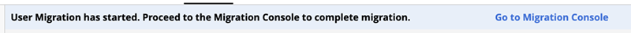
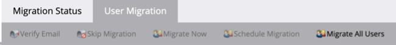

# Migration vers Adobe Identity {#migrating-to-adobe-identity}

Lorsque Adobe planifie la migration des utilisateurs d’un abonnement, les administrateurs de produit Marketo Engage ont accès à la console de migration, qui se trouve dans le menu de navigation de la zone Admin sous Intégration.

## Avant migration {#pre-migration}

Avant le début de la migration, un administrateur peut modifier la date de début de la migration de l’utilisateur pour son abonnement en accédant à l’écran de pré-migration dans la console de migration. Pour modifier la date, l’administrateur peut cliquer sur le bouton **Modifier** bouton .

L’administrateur peut choisir une date comprise entre 8 et 30 jours à l’avenir. Lorsqu’une date est sélectionnée, l’administrateur doit cliquer sur **Enregistrer** pour effectuer la modification.

>[!NOTE]
>
>Pour demander une date antérieure à 8 jours ou supérieure à 30, ou si vous devez ajuster la date après le verrouillage de la console de pré-migration, envoyez un email à `marketocares@marketo.com`.

## Migration vers Adobe Identity {#migrations-to-adobe-identity}

Tous les abonnements Marketo avec un fuseau horaire des États-Unis seront migrés à partir de minuit, heure normale du Pacifique, de la date de début de la migration des utilisateurs. La migration des utilisateurs pour tous les autres abonnements commencera à minuit le fuseau horaire spécifié de l’abonnement. Au début de la migration des utilisateurs d’un abonnement, la gestion des utilisateurs ne sera plus disponible dans la zone d’administration de Marketo et ne sera réalisée que dans Adobe Admin Console. La gestion des rôles reste dans l’onglet Utilisateurs et rôles de la zone d’administration de Marketo, ainsi que la gestion des utilisateurs locaux (API uniquement).

Adobe migre automatiquement en premier tous les administrateurs Marketo avec des emails vérifiés. Lorsque les administrateurs Marketo sont migrés vers Adobe Identity, ils sont ajoutés au Adobe Admin Console de l’abonnement en tant qu’administrateur de produit pour l’abonnement Marketo et se voient attribuer le rôle d’administrateur de produit Adobe dans l’application Marketo (ainsi que tout autre rôle qu’ils avaient auparavant) et leur Adobe ID a droit à l’abonnement. Les administrateurs recevront deux e-mails. L’une indique qu’il est affecté en tant qu’administrateur de produit Adobe, l’autre indique que son Adobe ID a droit au produit Marketo.

**Adresse électronique de l’administrateur du produit Marketo**

**Marketo Entitlement Email**

**Si votre abonnement Marketo comporte moins de 75 utilisateurs et ne dispose pas de l’authentification unique dans Marketo et/ou votre organisation d’Adobe**, Adobe migre automatiquement le reste de vos utilisateurs. Ce workflow vise à fournir le niveau d’automatisation le plus élevé et aucune action n’est requise pour exécuter la migration. Une fois la migration terminée, la console de migration Marketo n’apparaîtra plus dans la zone de navigation Admin de Marketo et tous les utilisateurs accéderont à Marketo à l’aide d’Adobe ID.

**Si votre abonnement Marketo comporte 75 utilisateurs ou plus ou dispose d’une authentification unique dans Marketo et/ou votre organisation d’Adobe**, les administrateurs de produit Marketo auront accès à l’outil de migration des utilisateurs en libre-service de la console de migration au début de la migration des utilisateurs et seront avertis via une bannière lors de leur connexion à la page Mon Marketo. L’administrateur sera chargé d’effectuer la migration des utilisateurs à l’aide de l’outil de migration des utilisateurs en libre-service.

## Migration des utilisateurs en libre-service de Marketo {#marketo-self-service-user-migration}

L’outil Console de migration des utilisateurs en libre-service de Marketo se compose de deux onglets.

* **Onglet État de migration**
* **Onglet Migration des utilisateurs**

### Onglet État de migration {#migration-status-tab}

L’onglet État de migration fournit des mesures générales sur l’état d’avancement des conditions préalables à la vérification des courriers électroniques des utilisateurs, la migration et l’activation des utilisateurs et la fin de la migration des abonnements.

En haut de l’état de migration, l’expiration de la migration des abonnements et le bouton permettant d’étendre l’expiration s’affichent. Vous trouverez plus d’informations sur l’expiration de la migration dans la section [Section Expiration de la migration des utilisateurs](#user-migration-expiration).

Dans la section suivante de l’onglet État de migration, deux barres de progression sont disponibles. La première barre de progression consiste à afficher la progression de la fin de la vérification des courriers électroniques des utilisateurs. La deuxième barre de progression consiste à afficher la progression de l’achèvement de la migration des utilisateurs.

Ensuite, trois sections de l’état s’affichent pour l’administrateur.

* **Vérification des e-mails de l’utilisateur**: état de vérification des utilisateurs dans l’abonnement.
* **Migration et activation des utilisateurs**: migration et activation des utilisateurs (migration et droits vers le produit du Marketo Engage) statut des utilisateurs dans l’abonnement.
* **Confirmation de migration**: état d’achèvement de la migration de l’abonnement.

#### Vérification des e-mails de l’utilisateur {#user-email-verification}

Dans la section Vérification des courriers électroniques utilisateur , un administrateur peut trouver l’état actuel de la vérification des courriers électroniques pour les utilisateurs inclus dans l’abonnement, avant la migration vers Adobe Identity.

Un administrateur peut afficher l’état de vérification des emails de l’abonnement, le pourcentage d’utilisateurs de l’abonnement ayant terminé la vérification des emails et le nombre d’utilisateurs qui ont été marqués comme ignorés. L’état sera reporté sur l’état de vérification des courriers électroniques de tous les utilisateurs dans l’abonnement. L’administrateur peut cliquer sur le nombre d’utilisateurs ignorés. Il accède alors à l’onglet Migration des utilisateurs pour afficher les utilisateurs ignorés.

L’e-mail de vérification peut être envoyé par un administrateur dans l’onglet Migration des utilisateurs de la console de migration et dans l’onglet Utilisateur et rôles de la zone d’administration de Marketo, ou par l’utilisateur dans les paramètres de son compte. Comme les courriers électroniques d’invitation des utilisateurs, le lien figurant dans le courrier électronique de vérification expire dans 3 jours. Vous trouverez plus d’informations sur la vérification des emails sur la page [Communauté](https://nation.marketo.com/) et dans le [documentation de vérification des emails](/help/marketo/product-docs/administration/users-and-roles/email-verification.md).

>[!IMPORTANT]
>
>Si un utilisateur Marketo Engage ne vérifie pas son adresse électronique, il ne peut pas être migré vers un Adobe ID et n’aura plus accès à l’abonnement Marketo une fois la migration terminée. Pour récupérer l’accès, un administrateur de produit Marketo doit les ajouter en tant que nouvel utilisateur.

#### Migration et activation des utilisateurs {#user-migration-and-activation}

Dans la section Migration et activation des utilisateurs , un administrateur peut trouver l’état actuel de la migration totale des utilisateurs et les droits sur Adobe Identity Management System.

Un administrateur peut afficher le pourcentage d’utilisateurs de son abonnement qui ont été migrés vers une Adobe ID ou marqués comme ignorés. L’état sera reporté à l’état de migration de tous les utilisateurs vers une Adobe ID dans l’abonnement, ou sera marqué comme Ignoré et ne sera pas migré. Lorsque les utilisateurs sont migrés et autorisés à accéder à Marketo Engage, ou ignorés, cet état est mis à jour.

#### Confirmation de migration {#migration-confirmation}

Dans la section Confirmation de migration , un administrateur doit confirmer que la migration des utilisateurs est terminée pour l’abonnement.

Une fois tous les utilisateurs de l’abonnement pris en compte (migrés ou ignorés), le bouton &quot;Terminer la migration&quot; s’affiche.

L’administrateur chargé de la migration doit effectuer la confirmation de migration en cliquant sur le bouton **Migration complète** bouton . Ils seront invités à **Confirmer**.

Une fois la migration des utilisateurs terminée, la console de migration est supprimée du menu de navigation Admin.

### Expiration de la migration des utilisateurs {#user-migration-expiration}

Adobe exige des clients qu’ils effectuent des migrations en libre-service dans les 30 jours. Les administrateurs ne seront pas empêchés de migrer les utilisateurs ni d’effectuer la migration si la date d’expiration est dépassée. Toutefois, ils ne pourront migrer les utilisateurs que sur demande. Si un administrateur a besoin de plus de temps, il peut prolonger la date d’expiration de l’abonnement.

Lorsque vous cliquez sur le bouton **Extension de l’expiration** , la date sera mise à jour à une semaine plus tard. Un administrateur peut étendre son expiration jusqu’à trois fois.

L’Adobe expire si vous ne terminez pas la migration avant la date d’expiration.

### Onglet Migration des utilisateurs {#user-migration-tab}

L’onglet Migration des utilisateurs fournit aux administrateurs les outils nécessaires pour contrôler entièrement la migration des utilisateurs.

Les administrateurs ont la possibilité de :

* Déclenchez les emails de vérification pour les utilisateurs non vérifiés via le bouton &quot;Vérifier le courrier électronique&quot;.
* Ignorer la migration des utilisateurs dont l’administrateur sait qu’ils ne peuvent pas vérifier l’adresse électronique ou ne doivent pas être migrés via le bouton Ignorer la migration
* Migrer les utilisateurs sélectionnés à la demande via le bouton &quot;Migrer maintenant&quot;
* Planification de la migration des utilisateurs pour certains utilisateurs à une date spécifique via le bouton &quot;Planifier la migration&quot;
* Migration de tous les utilisateurs éligibles à la demande (aucune sélection d’utilisateurs requise) via le bouton &quot;Migrer tous les utilisateurs&quot;

**Vérifier le courrier électronique**

La vérification des emails est requise pour qu’un utilisateur puisse être migré vers une Adobe ID. Si des utilisateurs n’ont pas vérifié leur adresse électronique et doivent être migrés, l’administrateur peut déclencher l’envoi à nouveau de l’e-mail de vérification. En sélectionnant un utilisateur non vérifié, le bouton &quot;Vérifier l&#39;email&quot; devient cliquable.

Lorsque l’administrateur clique sur le bouton **Vérifier le courrier électronique** , ils recevront une notification indiquant que l’email a été envoyé.

**Ignorer et ignorer la migration des utilisateurs**

Lors de la migration des utilisateurs, tous les utilisateurs doivent être migrés ou ignorés. Adobe exige des administrateurs qu’ils reconnaissent qu’un utilisateur ne sera pas migré et qu’un administrateur doit marquer l’utilisateur comme ignoré. Si l’administrateur ne le fait pas, il ne pourra pas confirmer la fin de la migration des utilisateurs. Tous les utilisateurs ignorés perdront l’accès à Marketo une fois la migration des utilisateurs terminée.

>[!IMPORTANT]
>
>Un administrateur doit ignorer tous les utilisateurs qui ont des courriers électroniques non vérifiés. Si des utilisateurs ont vérifié leurs emails, mais que l&#39;administrateur ne souhaite pas les migrer pour une raison quelconque, il doit les marquer comme ignorées.

Pour ignorer un utilisateur, l’administrateur peut sélectionner le ou les utilisateurs souhaités. Le bouton &quot;Ignorer la migration&quot; devient cliquable. Lorsque vous cliquez sur le bouton **Ignorer la migration** , la page s’actualise et l’état de vérification et de migration de l’utilisateur sélectionné est mis à jour sur &quot;Ignoré&quot;.

Un administrateur peut ignorer un utilisateur précédemment ignoré s’il est déterminé que l’utilisateur doit être migré.

Pour ignorer un utilisateur, l’administrateur peut sélectionner l’utilisateur de votre choix. Vous pouvez cliquer sur le bouton &quot;Désélectionner la migration&quot;. Lorsque vous cliquez sur le bouton **Annuler la migration** , la page s’actualise.  L’état de vérification de l’utilisateur sélectionné sera mis à jour vers son état actuel, &quot;vérifié&quot; ou &quot;non vérifié&quot;, et l’état de migration de l’utilisateur sera mis à jour vers &quot;Pas commencé&quot;.

>[!NOTE]
>
>Le bouton &quot;Ignorer la migration&quot; n’est actif que si tous les utilisateurs sélectionnés disposent d’un état de migration &quot;Ignoré&quot;.

### Migration d’utilisateurs Marketo vers des ID d’Adobe {#migrating-marketo-users-to-adobe-ids}

Les administrateurs de produit Marketo pourront sélectionner les utilisateurs à migrer par lots, ou tous les utilisateurs éligibles en même temps. Une fois les utilisateurs sélectionnés, les administrateurs ont la possibilité de &quot;Migrer maintenant&quot; ou &quot;Planifier la migration&quot; à une date ultérieure, ce qui offre aux administrateurs une certaine flexibilité et un contrôle sur les utilisateurs migrés et sur le moment où ils le sont. L’option &quot;Migrer tous les utilisateurs&quot; s’affiche également pour les administrateurs dans un abonnement.

Par exemple, un administrateur peut sélectionner un groupe d’&quot;utilisateurs experts&quot; qu’il souhaite migrer en premier. Une fois ces migrations d’utilisateurs terminées, ils peuvent sélectionner différents groupes d’utilisateurs en fonction de variables telles que workspace/business ou function/role pour effectuer d’autres migrations d’utilisateurs par lots. Ils peuvent également décider de migrer le reste des utilisateurs dans les abonnements après le succès du premier lot. L’objectif est de fournir la plus grande flexibilité possible pour déployer des identifiants d’Adobe vers les utilisateurs.

Toutes les migrations d’utilisateurs se produisent simultanément et doivent se terminer dans les 60 secondes. Lorsque la migration des utilisateurs se produit pour un utilisateur spécifique, l’utilisateur risque de perdre l’accès pendant une minute au maximum, c’est-à-dire uniquement si l’utilisateur est connecté à l’application. Une fois la migration des utilisateurs terminée, l’utilisateur reçoit un courrier électronique lui indiquant comment se connecter à Marketo Engage avec une identité d’Adobe. L&#39;utilisateur doit accepter l&#39;invitation via le lien du bouton présent dans l&#39;email. Après avoir accepté l’invitation, l’utilisateur doit se connecter avec un Adobe ID. Instructions relatives à la connexion à Marketo Engage avec un Adobe ID [peut être consulté ici](/help/marketo/product-docs/administration/marketo-with-adobe-identity/user-sign-in-with-adobe-id.md).

Les migrations d’utilisateurs sont traitées indépendamment. Par conséquent, si la migration d’un utilisateur échoue, l’Adobe continue à traiter d’autres migrations d’utilisateurs. Si une migration d’utilisateur échoue, aucune action n’est requise par un administrateur. L’administrateur recevra une notification par e-mail l’informant que l’Adobe s’efforce de résoudre le problème immédiatement. Si la migration d’un utilisateur échoue et qu’il est connecté au Marketo Engage, l’utilisateur risque de perdre l’accès pendant deux minutes au maximum pendant les tentatives de migration. Si la migration d’un utilisateur échoue, l’utilisateur peut continuer à accéder au Marketo Engage avec son identité Marketo jusqu’à ce qu’il reçoive une notification par e-mail lui indiquant que sa migration a réussi, et il est invité à se connecter avec un Adobe ID.

**Migrer maintenant**

Un administrateur peut sélectionner un ou plusieurs utilisateurs à migrer à la demande. Cela déclenche immédiatement la migration des utilisateurs. Pour migrer un ou plusieurs utilisateurs, l&#39;administrateur peut sélectionner le ou les utilisateurs souhaités, et le bouton &quot;Migrer maintenant&quot; devient cliquable.

>[!NOTE]
>
>Le bouton &quot;Migrer maintenant&quot; n’est actif que si tous les utilisateurs sélectionnés disposent d’un état de vérification &quot;vérifié&quot;.

Lorsque vous cliquez sur le bouton **Migrer maintenant** , l’administrateur est invité à confirmer la migration du ou des utilisateurs sélectionnés. Une fois que l’administrateur l’a confirmé, les migrations des utilisateurs commenceront le traitement dès que possible.

**Planification de la migration**

Un administrateur peut sélectionner un ou plusieurs utilisateurs pour planifier la migration à une date ultérieure. Pour planifier la migration d’un ou de plusieurs utilisateurs, l’administrateur sélectionne le ou les utilisateurs souhaités et le bouton &quot;Planifier la migration&quot; devient cliquable.

>[!NOTE]
>
>Le bouton &quot;Planification de la migration&quot; n’est actif que si tous les utilisateurs sélectionnés disposent d’un état de vérification &quot;Vérifié&quot;.

Lorsque vous cliquez sur le bouton **Planification de la migration** , l’administrateur est invité à sélectionner la date de migration de votre choix pour le ou les utilisateurs sélectionnés. L’administrateur ne peut sélectionner que des dates avant la date d’expiration de migration de l’abonnement. Lorsque l’administrateur le confirme, le traitement de la ou des migration des utilisateurs est planifié à la date sélectionnée.

>[!NOTE]
>
>Tous les abonnements Marketo avec un fuseau horaire des États-Unis seront migrés à partir de minuit, heure du Pacifique, à partir de la date de début de la migration. La migration des utilisateurs pour tous les autres abonnements commencera à minuit le fuseau horaire spécifié de l’abonnement.

**Migrer tous les utilisateurs**

A tout moment, un administrateur peut choisir de migrer tous les utilisateurs éligibles dans un abonnement. Cela déclenchera immédiatement la migration des utilisateurs éligibles. Les utilisateurs éligibles sont les utilisateurs disposant d’emails vérifiés qui n’ont pas encore été migrés.

Lorsque vous cliquez sur le bouton **Migrer tous les utilisateurs** , l’administrateur est invité à **Confirmer** migration de tous les utilisateurs éligibles. Lorsque l’administrateur le confirme, les migrations des utilisateurs commencent le traitement dès que possible.

