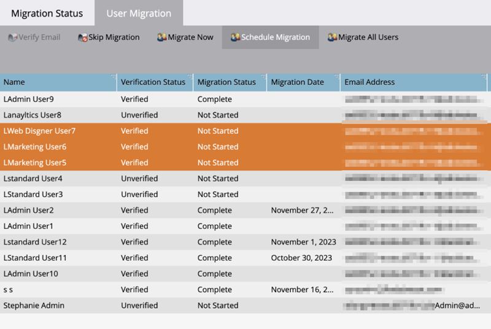

# Migration vers une identité d’Adobe {#migrating-to-adobe-identity}

Lorsque Adobe planifie la migration des utilisateurs d’un abonnement, les administrateurs de produit Marketo Engage ont accès à la console de migration qui se trouve dans le menu de navigation de la zone Admin sous Intégration.

## Pré-migration {#pre-migration}

Avant le début de la migration, un administrateur peut modifier la date de début de la migration des utilisateurs pour son abonnement en accédant à l’écran Pré-migration dans la console de migration. Pour modifier la date, l’administrateur peut cliquer sur le bouton **Modifier**.

L’administrateur peut choisir une date comprise entre 8 et 30 jours à l’avenir. Lorsqu’une date est sélectionnée, l’administrateur doit cliquer sur **Enregistrer** pour apporter la modification.

>[!NOTE]
>
>Pour demander une date antérieure à 8 jours ou supérieure à 30, ou si vous devez ajuster la date après le verrouillage de la console de pré-migration, envoyez un e-mail à `marketocares@marketo.com`.

## Migrations vers une identité d’Adobe {#migrations-to-adobe-identity}

Tous les abonnements Marketo avec fuseau horaire des États-Unis seront migrés à partir de minuit, heure standard du Pacifique, de la date de début de la migration des utilisateurs et utilisatrices. La migration des utilisateurs pour tous les autres abonnements commencera à minuit dans le fuseau horaire spécifié par l&#39;abonnement. Lorsque la migration des utilisateurs d’un abonnement commence, la gestion des utilisateurs n’est plus disponible dans la zone d’administration de Marketo. Elle est uniquement disponible dans Adobe Admin Console. La gestion des rôles reste dans l’onglet Utilisateurs et rôles de la zone d’administration de Marketo, ainsi que dans la gestion des utilisateurs locaux (API uniquement).

Adobe migre automatiquement tous les administrateurs Marketo avec les e-mails vérifiés en premier. Lorsque les administrateurs Marketo sont migrés vers Adobe Identity, ils sont ajoutés à la Adobe Admin Console de l’abonnement en tant qu’administrateurs de produit pour l’abonnement Marketo et se voient attribuer le rôle d’administrateur de produit Adobe dans l’application Marketo (ainsi que tout autre rôle qu’ils avaient précédemment) et leur Adobe ID est autorisé à souscrire l’abonnement. Les administrateurs recevront deux courriers électroniques. L’un indique qu’il est affecté en tant qu’administrateur de produit Adobe, l’autre indique que son Adobe ID a droit au produit Marketo.

>[!IMPORTANT]
>
>Vous devez cliquer sur le bouton **Accepter l’invitation** dans l’e-mail de droits pour accéder à Marketo Engage avec votre Adobe ID.

**E-mail de l’administrateur du produit Marketo**

**Adresse e-mail des droits Marketo**

**Si votre abonnement Marketo comporte moins de 75 utilisateurs et ne dispose pas de l’authentification unique dans Marketo et/ou votre organisation d’Adobe**, Adobe migre automatiquement le reste de vos utilisateurs. Ce workflow vise à fournir le niveau d’automatisation le plus élevé possible et aucune action n’est requise pour exécuter la migration. Une fois la migration terminée, la console de migration Marketo n’apparaît plus dans la zone de navigation d’administration de Marketo et tous les utilisateurs accèdent à Marketo à l’aide d’une Adobe ID.

**Si votre abonnement Marketo comporte 75 utilisateurs ou plus, ou dispose d’une authentification unique dans Marketo et/ou votre organisation Adobe**, les administrateurs de produit Marketo auront accès à l’outil de migration d’utilisateurs en libre-service de la console de migration dès le début de la migration des utilisateurs et seront alertés via la bannière lors de la connexion sur la page My Marketo. L’administrateur sera chargé d’effectuer la migration des utilisateurs à l’aide de l’outil de migration des utilisateurs en libre-service.

## Migration d’utilisateurs en libre-service Marketo {#marketo-self-service-user-migration}

L’outil Console de migration des utilisateurs en libre-service de Marketo se compose de deux onglets.

* **Onglet Statut de migration**
* **Onglet Migration des utilisateurs**

Trois étapes principales sont requises pour effectuer une migration en libre-service.

1. Effectuez la migration de tous les utilisateurs admissibles vérifiés par adresse électronique (onglet Migration des utilisateurs)
1. Ignorer tous les utilisateurs non éligibles et tous les utilisateurs éligibles indésirables (onglet Migration des utilisateurs)
1. Une fois les étapes 1 et 2 terminées, confirmez la migration (onglet Statut de la migration)

### Onglet Statut de migration {#migration-status-tab}

L’onglet Statut de migration fournit des mesures globales sur la progression de la condition préalable de vérification des e-mails des utilisateurs, la migration et l’activation des utilisateurs, ainsi que la fin de la migration des abonnements.

En haut du Statut de migration, l’expiration de la migration des abonnements et le bouton permettant d’étendre l’expiration s’affichent. Vous trouverez plus d’informations sur l’expiration de la migration dans la section [ Expiration de la migration des utilisateurs ](#user-migration-expiration).

La section suivante de l’onglet Statut de migration comporte deux barres de progression. La première barre de progression permet d’afficher la progression de la vérification des e-mails des utilisateurs. La deuxième barre de progression permet d’afficher l’avancement de la migration des utilisateurs et utilisatrices.

Trois sections du Statut s’affichent ensuite pour l’administrateur.

* **Vérification des e-mails des utilisateurs** : statut de vérification des utilisateurs dans l’abonnement.
* **Migration et activation des utilisateurs** : statut de migration et d’activation des utilisateurs (migration et droit au produit de Marketo Engage) des utilisateurs au sein de l’abonnement.
* **Confirmation de migration** : statut d’achèvement de la migration de l’abonnement.

#### Vérification de l’adresse e-mail de l’utilisateur {#user-email-verification}

Dans la section Vérification de l’e-mail des utilisateurs , un administrateur peut consulter le statut actuel de la vérification de l’e-mail pour les utilisateurs dans l’abonnement, avant la migration vers l’identité d’Adobe.

Un administrateur peut afficher l’état de vérification de l’abonnement par e-mail, le pourcentage d’utilisateurs de l’abonnement qui ont terminé la vérification par e-mail et le nombre d’utilisateurs qui ont été marqués comme ignorés. Le statut sera signalé lors de l’état de vérification des e-mails de tous les utilisateurs dans l’abonnement. L’administrateur peut cliquer sur le nombre d’utilisateurs ignorés et accède à l’onglet Migration des utilisateurs pour afficher les utilisateurs ignorés.

L’e-mail de vérification peut être envoyé par un administrateur dans l’onglet Migration des utilisateurs de la console de migration et l’onglet Utilisateur et rôles dans la zone Administrateur Marketo, ou par l’utilisateur dans les paramètres de son compte. Comme pour les e-mails d’invitation d’utilisateur, le lien contenu dans l’e-mail de vérification expire dans 3 jours. Vous trouverez plus d’informations sur la vérification des e-mails dans la [Communauté](https://nation.marketo.com/) et dans la [documentation sur la vérification des e-mails](/help/marketo/product-docs/administration/users-and-roles/email-verification.md).

>[!IMPORTANT]
>
>Si un utilisateur Marketo Engage ne vérifie pas son adresse e-mail, il ne peut pas être migré vers une Adobe ID et perdra l’accès à l’abonnement Marketo une fois la migration terminée. Pour récupérer l’accès, un administrateur de produit Marketo doit les ajouter en tant que nouvel utilisateur.

#### Migration et activation des utilisateurs {#user-migration-and-activation}

Dans la section Migration et activation des utilisateurs, un administrateur peut consulter l’état actuel de la migration totale des utilisateurs et des droits d’accès au système Identity Management Adobe.

Un administrateur peut afficher le pourcentage d’utilisateurs dans leur abonnement qui ont été migrés vers une Adobe ID ou marqués comme Ignorés. Le statut sera signalé sur le statut de migration de tous les utilisateurs vers une Adobe ID dans l’abonnement, ou marqué comme Ignoré et ne sera pas migré. À mesure que les utilisateurs sont migrés et autorisés à utiliser Marketo Engage, ou ignorés, ce statut est mis à jour.

#### Confirmation de migration {#migration-confirmation}

Dans la section Confirmation de la migration , un administrateur sera invité à confirmer que la migration des utilisateurs est terminée pour l’abonnement.

Une fois que tous les utilisateurs de l’abonnement sont comptabilisés (migrés ou ignorés), le bouton « Terminer la migration » s’affiche.

L’administrateur chargé de la migration doit terminer la confirmation de migration en cliquant sur le bouton **Terminer la migration**. Ils seront invités à **Confirmer**.

Une fois la fin de la migration des utilisateurs confirmée, la console de migration est supprimée du menu de navigation d’administration.

### Expiration de la migration des utilisateurs {#user-migration-expiration}

L’Adobe nécessite que les clients effectuent des migrations en libre-service dans les 30 jours. La migration des utilisateurs ou la fin de la migration ne sera pas bloquée pour les administrateurs si la date d’expiration est dépassée. Cependant, ils ne pourront migrer les utilisateurs qu’à la demande. Si un administrateur a besoin de plus de temps, il peut prolonger la date d’expiration de l’abonnement.

Lorsque vous cliquez sur le bouton **Prolonger l’expiration**, la date est mise à jour une semaine plus tard. Un administrateur peut prolonger leur expiration jusqu’à trois fois.

Adobe vous contactera si vous n’avez pas terminé la migration à la date d’expiration.

### Onglet Migration des utilisateurs {#user-migration-tab}

L’onglet Migration des utilisateurs et utilisatrices fournit aux administrateurs et administratrices les outils permettant de contrôler entièrement la migration des utilisateurs et utilisatrices.

Les administrateurs ont la possibilité de :

* Déclencher des e-mails de vérification pour les utilisateurs non vérifiés via le bouton « Vérifier l’e-mail »
* Ignorer la migration des utilisateurs pour les utilisateurs dont l’administrateur sait qu’ils ne peuvent pas ou ne veulent pas vérifier leur e-mail ou qui ne doivent pas être migrés via le bouton « Ignorer la migration »
* Migrer les utilisateurs sélectionnés à la demande via le bouton « Migrer maintenant »
* Planifiez la migration des utilisateurs pour les utilisateurs sélectionnés à une date spécifique à l’aide du bouton Planifier la migration .
* Migrez tous les utilisateurs éligibles à la demande (aucune sélection d’utilisateur nécessaire) via le bouton « Migrer tous les utilisateurs ».

**Vérifier l’e-mail**

La vérification par e-mail est requise pour qu’un utilisateur puisse être migré vers Adobe ID. Si des utilisateurs n’ont pas vérifié leur adresse e-mail et doivent être migrés, l’administrateur peut déclencher l’envoi de l’e-mail de vérification à l’utilisateur à nouveau. En sélectionnant un utilisateur non vérifié, vous pouvez cliquer sur le bouton « Vérifier l’e-mail ».

Lorsque l’administrateur clique sur le bouton **Vérifier l’e-mail**, il reçoit une notification indiquant que l’e-mail a été envoyé.

**Ignorer et annuler la migration des utilisateurs**

Lors de la migration des utilisateurs, tous les utilisateurs doivent être migrés ou ignorés. L’Adobe nécessite que les administrateurs reconnaissent qu’un utilisateur ne sera pas migré et qu’un administrateur marque l’utilisateur comme étant ignoré. Si l’administrateur ne le fait pas, il ne sera pas en mesure de confirmer la fin de la migration des utilisateurs. Tous les utilisateurs ignorés perdront l’accès à Marketo une fois la migration des utilisateurs terminée.

>[!IMPORTANT]
>
>Un administrateur doit ignorer tous les utilisateurs dont les e-mails ne sont pas vérifiés. Si des utilisateurs ont vérifié leurs e-mails, mais que l’administrateur ne souhaite pas les migrer pour une raison quelconque, ils doivent les marquer comme ignorés.

Pour ignorer un utilisateur, l’administrateur peut sélectionner l’utilisateur ou les utilisateurs souhaités. Cliquez sur le bouton « Ignorer la migration ». Lorsque vous cliquez sur le bouton **Ignorer la migration**, la page s’actualise et le statut de vérification et de migration de l’utilisateur sélectionné passe à « Ignoré ».

Un administrateur peut annuler l’omission d’un utilisateur, s’il est déterminé qu’il doit être migré.

Pour annuler l’omission d’un utilisateur, l’administrateur peut sélectionner l’utilisateur souhaité. Cliquez sur le bouton « Annuler la migration ». Lorsque vous cliquez sur le bouton **Annuler la migration**, la page s’actualise.  Le statut de vérification de l&#39;utilisateur sélectionné sera mis à jour vers son statut actuel, soit &#39;Vérifié&#39; ou &#39;Non vérifié&#39;, et le statut de migration de l&#39;utilisateur sera mis à jour vers &#39;Non démarré&#39;.

>[!NOTE]
>
>Le bouton « Annuler la migration » n’est actif que si tous les utilisateurs sélectionnés ont un statut de migration « Ignorée ».

### Migration des utilisateurs de Marketo vers des ID d’Adobe {#migrating-marketo-users-to-adobe-ids}

Les administrateurs et administratrices de produit Marketo pourront sélectionner les utilisateurs et utilisatrices à migrer par lots, ou tous les utilisateurs et utilisatrices éligibles en même temps. Une fois les utilisateurs sélectionnés, les administrateurs ont la possibilité de « Migrer maintenant » ou de « Planifier la migration » à une date ultérieure, ce qui leur donne une certaine flexibilité et un contrôle sur les utilisateurs migrés et la date de migration. Les administrateurs ont également la possibilité de « Migrer tous les utilisateurs » dans un abonnement.

Par exemple, un administrateur peut sélectionner un groupe d’« utilisateurs expérimentés » qu’il souhaite migrer en premier. Une fois ces migrations d’utilisateurs terminées, ils peuvent sélectionner différents groupes d’utilisateurs en fonction de variables telles que workspace/business ou function/role pour effectuer d’autres migrations d’utilisateurs par lots. Ils peuvent également décider de migrer le reste des utilisateurs et utilisatrices dans les abonnements une fois le premier lot terminé. L’objectif est d’offrir la plus grande flexibilité dans le déploiement des ID d’Adobe aux utilisateurs.

Toutes les migrations des utilisateurs et utilisatrices se produisent simultanément et doivent se terminer correctement en soixante secondes. Lorsqu’une migration d’utilisateur est en cours pour un utilisateur spécifique, celui-ci peut perdre l’accès pendant une minute au maximum, et cela uniquement s’il est connecté à l’application. Une fois la migration de l’utilisateur terminée, l’utilisateur recevra un e-mail lui indiquant comment se connecter à Marketo Engage avec une identité Adobe. L’utilisateur doit accepter l’invitation via le lien du bouton dans l’e-mail _avant_ il peut se connecter à l’aide d’un Adobe ID. Les instructions pour se connecter à Marketo Engage à l’aide d’un Adobe ID [sont disponibles ici](/help/marketo/product-docs/administration/marketo-with-adobe-identity/user-sign-in-with-adobe-id.md).

Les migrations des utilisateurs et utilisatrices sont traitées indépendamment. Par conséquent, si une migration d’utilisateurs échoue, Adobe continuera à traiter les autres migrations d’utilisateurs et d’utilisatrices. Si un échec de migration d’utilisateur se produit, aucune action n’est requise de la part de l’administration. L’administrateur recevra une notification par e-mail de l’erreur et sera averti que l’Adobe s’efforce de résoudre le problème immédiatement. Si la migration d’un utilisateur échoue et que cet utilisateur est connecté à Marketo Engage, il peut perdre l’accès pendant deux minutes maximum, le temps que les tentatives de migration se reproduisent. Si la migration d’un utilisateur échoue, l’utilisateur peut continuer à accéder à Marketo Engage avec son identité Marketo jusqu’à ce qu’il reçoive une notification par e-mail indiquant que sa migration a réussi, et qu’il soit invité à se connecter à l’aide d’un Adobe ID.

**Migration immédiate**

Un administrateur peut sélectionner un ou plusieurs utilisateurs pour migrer à la demande. Cela déclenchera immédiatement la migration des utilisateurs. Pour migrer un ou plusieurs utilisateurs, l’administrateur peut sélectionner le ou les utilisateurs souhaités, et il sera possible de cliquer sur le bouton « Migrer maintenant ».

>[!NOTE]
>
>Le bouton « Migrer maintenant » n’est actif que si tous les utilisateurs sélectionnés ont un statut de vérification « Vérifié ».

Lorsque vous cliquez sur le bouton **Migrer maintenant**, l’administrateur est invité à confirmer la migration des utilisateurs sélectionnés. Une fois que l’administrateur a confirmé, les migrations des utilisateurs et utilisatrices commenceront à être traitées dès que possible.

**Planifier la migration**

Un administrateur peut sélectionner un ou plusieurs utilisateurs pour planifier la migration à une date ultérieure. Pour planifier la migration d’un ou de plusieurs utilisateurs, l’administrateur sélectionne le ou les utilisateurs souhaités, et il est possible de cliquer sur le bouton « Planifier la migration ».

>[!NOTE]
>
>Le bouton « Planifier la migration » est uniquement actif si tous les utilisateurs sélectionnés ont le statut de vérification « Vérifié ».

En cliquant sur le bouton **Planifier la migration**, l’administrateur est invité à sélectionner la date de migration souhaitée pour le ou les utilisateurs sélectionnés. L’administrateur ne peut sélectionner que des dates antérieures à la date d’expiration de la migration de l’abonnement. Lorsque l’administrateur confirme, le traitement de la ou des migrations d’utilisateurs est planifié à la date sélectionnée.

>[!NOTE]
>
>Tous les abonnements Marketo avec fuseau horaire des États-Unis seront migrés à partir de minuit, heure standard du Pacifique, de la date de début de la migration. La migration des utilisateurs pour tous les autres abonnements commencera à minuit dans le fuseau horaire spécifié par l&#39;abonnement.

**Migrer tous les utilisateurs**

Un administrateur peut choisir de migrer tous les utilisateurs éligibles dans un abonnement, à tout moment. Cela déclenchera immédiatement la migration des utilisateurs éligibles. Les utilisateurs éligibles sont ceux dont les e-mails ont été vérifiés et qui n’ont pas encore été migrés.

En cliquant sur le bouton **Migrer tous les utilisateurs**, l’administrateur est invité à **Confirmer** la migration de tous les utilisateurs éligibles. Lorsque l’administrateur confirme cette opération, les migrations des utilisateurs et utilisatrices commencent à être traitées dès que possible.

