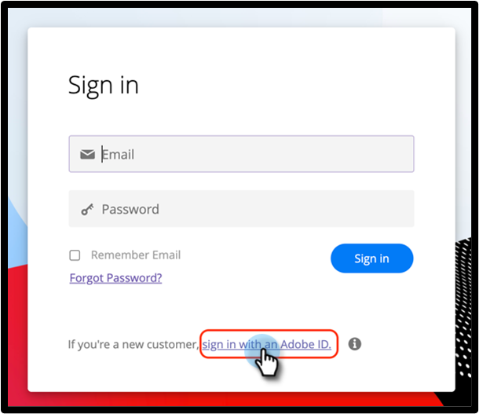

# Connexion d’utilisateur ou d’utilisatrice avec Adobe ID {#user-sign-in-with-adobe-id}

Lorsqu’une personne disposant d’Adobe Identity doit se connecter à l’application Marketo Engage, elle doit le faire via le lien de connexion Adobe ID, contrairement à la connexion standard sur la page de connexion Marketo Engage. En cliquant sur le lien, la personne est redirigée vers l’application Marketo Engage.

1. Cliquez sur **[!UICONTROL Continuer avec Adobe ID]** sur la page de connexion de Marketo Engage.

   

1. Saisissez vos informations d’identification Adobe et cliquez sur **[!UICONTROL Continuer]**.

   

Une fois la connexion établie, vous accédez à l’application Marketo Engage.
