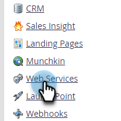
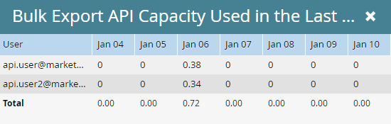

# Informations sur l’API d’exportation en masse {#bulk-export-api-information}

Découvrez comment vérifier la quantité de capacité [API d’extraction en bloc](https://experienceleague.adobe.com/en/docs/marketo-developer/marketo/rest/bulk-extract/bulk-extract){target="_blank"} qui a été absorbée par votre instance Marketo Engage au cours des sept derniers jours.

>[!NOTE]
>
>Si vous avez besoin de capacité supplémentaire, contactez votre représentant de compte.

1. Accédez à la zone **[!UICONTROL Admin]**.

   

1. Cliquez sur **[!UICONTROL Services web]**.

   

1. Faites défiler l’écran jusqu’à la carte Informations de l’API d’exportation en bloc . Cliquez sur le nombre en regard de « 7 derniers jours » pour afficher l’utilisation par jour/utilisateur de l’API.

   

   

>[!NOTE]
>
>L’allocation de votre instance Marketo Engage se réinitialise tous les jours à 12 :00 HNC.
