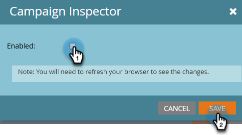
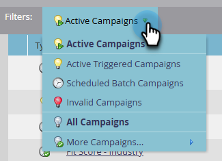

# Inspecteur de campagne {#campaign-inspector}

Utilisez l’Inspecteur de campagne pour afficher/rechercher toutes vos campagnes intelligentes au même endroit.

## Activer l’inspecteur Campaign {#enable-campaign-inspector}

1. Accédez à la zone **[!UICONTROL Admin]**.

   

1. Cliquez sur **[!UICONTROL Coffre au trésor]**.

   

1. Cliquez sur **[!UICONTROL Modifier]** en regard de l’Inspecteur de campagne.

   

1. Sélectionnez la case à cocher **[!UICONTROL Activé]** et cliquez sur **[!UICONTROL Enregistrer]**.

   

   >[!NOTE]
   >
   >L’espace de travail souhaité doit être sélectionné dans l’arborescence pour afficher l’onglet Inspecteur de campagne une fois qu’il est activé.

## Utilisation de l’Inspecteur Campaign {#using-campaign-inspector}

Une fois activé, l’onglet Inspecteur de campagne se trouve à côté de l’onglet Activités marketing .

Cliquez sur le menu déroulant **[!UICONTROL Campagnes actives]** pour filtrer selon différents types de campagnes.

Au bas de la page, accédez à des outils utiles tels que la barre de recherche ou l’exportation de vos résultats.

