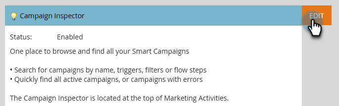

# Inspecteur de campagne {#campaign-inspector}

Utilisez l’ Inspecteur de campagne pour afficher/rechercher toutes vos campagnes intelligentes à un seul endroit.

## Activer l’Inspecteur de campagne {#enable-campaign-inspector}

1. Cliquez sur l&#39;icône **Admin**.

   

1. Cliquez sur **Poitrine au trésor**.

   

1. Cliquez sur **Modifier** en regard de l’Inspecteur de campagne.

   

1. Sélectionnez la **Activé** , puis cliquez sur **Enregistrer**.

   

## Utilisation de l’Inspecteur de campagne {#using-campaign-inspector}

Une fois activé, l’onglet Inspecteur de campagne se trouve en regard de l’onglet Activités marketing .

Cliquez sur le bouton **Principales campagnes** pour filtrer selon différents types de campagnes.

Au bas de la page, accédez à des outils utiles tels que la barre de recherche ou exportez vos résultats.

